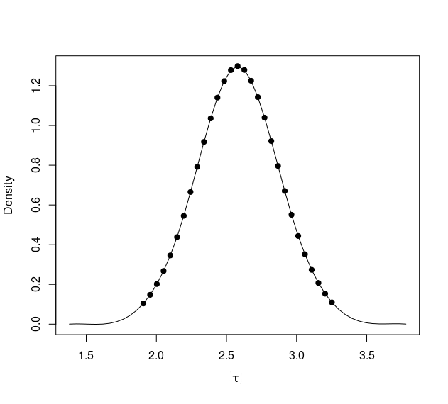
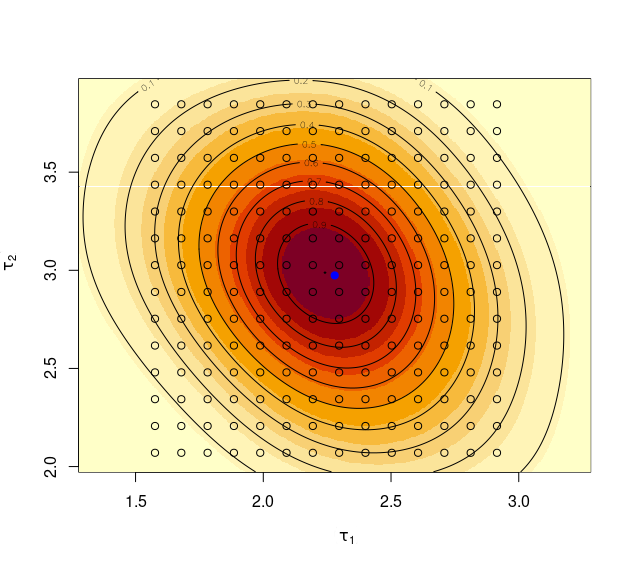
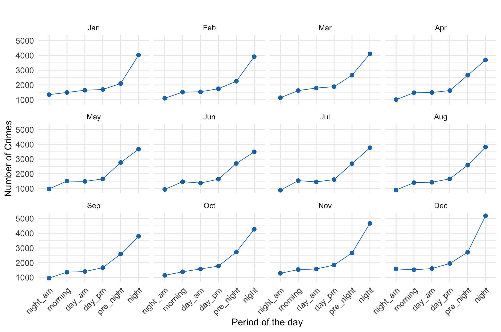
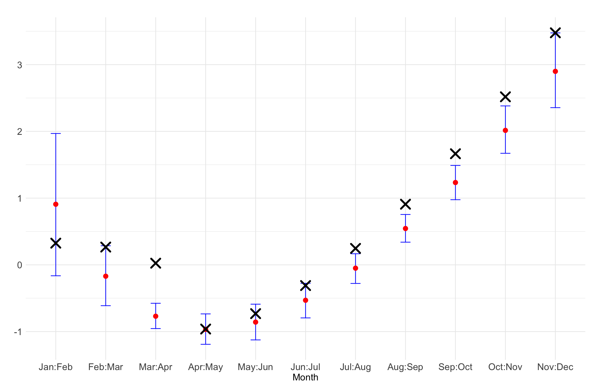

```{r, load_refs, echo=FALSE, cache=FALSE, message=FALSE}
library(RefManageR)
BibOptions(check.entries = FALSE, 
           bib.style = "authoryear", 
           cite.style = 'authoryear', 
           style = "markdown",
           hyperlink = FALSE, 
           dashed = FALSE)
myBib <- ReadBib("assets/bibliografia.bib", check = FALSE)
top_icon = function(x) {
  icons::icon_style(
    icons::fontawesome(x),
    position = "fixed", top = 10, right = 10
  )
}


```

<style>
p.caption {
  font-size: 0.6em;
}
</style>

### Overview
___

- Introduction

- Conditional Transformation Models

- Bayesian Conditional Transformation Models


- Posterior inference
  - Integrated Laplace with Bayesian Conditional
Transformation Models
  - Variational Bayes correction to BCTM


---

- Simulation studies
  - Study 1: Evaluating the ILBCTM performance
  - Study 2: BCTM with Bernstein polynomials

- Applications 
  - Head circumference
  - Framingham heart study
  - Sleep deprivation study

- Original dataset applications
  - Modeling the mortality rate from bronchial and
lung cancer in Brazil
  - Analysis of vehicle theft incident in the city of São
Paulo

- Final Remarks

---

###Introduction 

___

- The primary objective of regression models is to estimate the conditional probability distribution $F_{Y|X=x}$ of a random variable $Y$, given an explanatory variable $X$ with an observed value $x$.
- Many regression models focus exclusively on the conditional expected value $E(Y|X=x)$, assuming that other moments of the distribution remain fixed.

```{r, echo=FALSE,  out.width = "50%", dpi = 300 , fig.retina = 2,fig.align='center'}

```

---

#### Alternatives
- An approach that guarantees the flexibilization of some assumptions in the class of regression models is the Generalized additive model for the location, scale, and shape (GAMLSS) class.
- Quantile regression models `r Citep(myBib,"koenker2001quantile")` provide a flexible alternative to regression models. In quantile regression, each conditional quantile is modeled independently as a function of linear or smooth terms of the explanatory variables.


---
#### If we go further...


```{r, echo=FALSE,  out.width = "50%", dpi = 300 , fig.retina = 2,fig.align='center'}
knitr::include_graphics("figuras/Imagem-5-1.png")
```

---
#### But how?

- Fully Nonparametric? No! Conditional Transformation models!

- The idea is to find $F_{Y|x}$, but indirectly, using a transformation of random variables.

- **Conditional** on $x$, the approach applies a **Transformation** function $h(Y|x)$ to the random variable $Y$; by composing this transformation with a baseline distribution, we obtain a **Model** for the variable $Y$ given $x$.

- Formally, the CTM was first introduced by `r Citet(myBib,"hothorn2014conditional")`. The definition involves concepts of conditional probability and random variable transformation.

- `r Citet(myBib,"carlan2023bayesian")` presented the Bayesian Conditional Transformation Model (BCTM). Building on the same definition as the CTM, this approach proposed a different parameterization for the transformation function $h(Y|x)$.


---
#### What about this work?

- In this work, we contribute to the CTM class and, more specifically, to the BCTM. We present two alternative and efficient Bayesian estimation procedures for the BCTM.
- We also propose an alternative parameterization for the transformation functions $h(y|x)$, distinct from the one presented in `r Citet(myBib,"carlan2023bayesian")` . 
- The CTM class of models suffers from a lack of interpretability due to its construction. In this work, we propose to adapt some techniques to evaluate how a particular variable $x$ impacts both the expected value of $Y$ and the quantiles of the distribution of $Y$.

- Finally, we illustrated our methods using real data applications.

---
### Conditional Transformation Models

___

- The transformation of random variables is a widely used technique in statistical modeling to adjust the distribution of a dependent variable.

- The Box-Cox transformation is a classic example, where a parameter $\lambda$ is used to adjust the variable in such a way that the variance is stabilized and the distribution becomes closer to normal.

- The CTM extend the transformation models class by allowing the transformation functions depending on a set of M explanatory variables $\boldsymbol{X} \in \mathbb{R}^{M}$.

- These new transformation functions from CTM are univariate functions of the response variable, conditional on fixed values of explanatory variables $\boldsymbol{X} = \boldsymbol{x}$:

$$h(Y|\boldsymbol{x}): \mathbb{R} \rightarrow \mathbb{R}$$

---

- But, we have a transformation on an unkwnown random variable. What's next?

- Assuming that $h(Y|\boldsymbol{x})$ follows a known probability distribution (First assumption)

$$
h(Y|\boldsymbol{x}) + F_Z = \text{CTM}
$$


Thus,

$$
    F_{Y|\boldsymbol{X} = \boldsymbol{x}}(y) = P(h(Y|\boldsymbol{x}) \leq h(y|\boldsymbol{x})) = F_Z(h(y|\boldsymbol{x}))
$$
- The conditional transformation function $h(Y \mid \boldsymbol{x})$ is monotonically increasing in $y \in \mathbb{R}$, conditional on $\boldsymbol{X} = \boldsymbol{x}$ (Second assumption).

- Besides that, right continuous and differentiable (Third assumption).


- It is convenient to assume $Z\sim N(0,1)$.

---

- The construction of $h(y|\boldsymbol{x})$ must account for all the characteristics and objectives of the proposed model (Monotonic on $y$).

- It is convenient to decompose the transformation function $h$ additively into $J$ partial transformation functions, defined for all $\boldsymbol{x} \in \mathbb{R}^M$.


$$\begin{equation}
    h(y|\boldsymbol{x}) = \sum_{j = 1}^J h_j(y|\boldsymbol{x}).
\end{equation}$$


- At the end of the day, the task of obtaining $F_{Y|\boldsymbol{X} = \boldsymbol{x}}$ reduces to estimating the transformation function $h$.


---
### Example of a simple CTM

Assume $J= 3$ and 
    \begin{equation}
        h(y \mid x) = h_1(y) + h_2(y \mid x) + h_3(x) = \gamma_0 + \gamma_1 \cdot y + \gamma_2 \cdot x \cdot y + \gamma_3 \cdot x.
    \end{equation}
    
- The first transformation function $h_1(y) = \gamma_1 \cdot y$ is a linear function of y .
- The second transformation function $h_2(y|\boldsymbol{x}) = \gamma_2 \cdot x \cdot y$ involves a linear interaction between $y$ and $x$.
- The last transformation function $h_3(\boldsymbol{x}) = \gamma_0 +  \gamma_4 \cdot x$ describes marginal effects of $x$.
- If Z is normal, linear combination of $Y$ would be Normal too.
---

- Assuming linear transformation of the response variable, like $h(y) = y \cdot \gamma$ or even $h(y|x) = y \cdot x \cdot \gamma$, will only give us Gaussian models. 

- To leave the class of Gaussian models, we have to increase the $h(y)$ complexity. 

- This transformation can take a familiar form, such as $\log$. 

- An alternative use basis functions which define a functions space, and to represent every function as a linear combination of basis function.

- But many questions and challenges arise from this approach.
  - The functions should express many possible different functions, but they should preferably be smooth (3,4).
  - How much smooth should they be?
  - They should be monotone(2).

  
---
#### First,
- This parameterization as a linear combination of functions proposed by `r Citet(myBib,"hothorn2018most")` facilitates a more general definition for the CTM class.

- First, let us parameterize the transformation function as a linear function of evaluated basis of $y$,

$$
\boldsymbol{a}: \mathbb{R} \rightarrow \mathbb{R}^v,
$$
such that

$$\begin{equation}\label{hy}
h_j(y) = \boldsymbol{a(y)}^{\top} \boldsymbol{\gamma}, \boldsymbol{\gamma} \in \mathbb{R}^v,
\end{equation}$$

for some $j$ in $h(y|x)$. 


- Combining the transformation in (\ref{hy}) with some explanatory variables $\boldsymbol{x}$ for different $j's$ can yield a model different from the Normal (as long as it is an appropriate basis).


---
#### Now let us take a look to $x$

- We can also define a bases for $x$ to assume more than linear effects.

- Let $\boldsymbol{b}: \mathbb{R} \rightarrow \mathbb{R}^m$ denote a basis for explanatory variables such that

$$h_j(y) = \boldsymbol{b}(x)^{\top} \boldsymbol{\gamma}, \boldsymbol{\gamma} \in \mathbb{R}^m,$$

for some $j$. **There is no monotonicity constraint, but it is convenient for it to be a smooth function**.

- We can consider fixed effects and random effects in the transformation function.

- **Finally**, the joint basis is $\boldsymbol{c}: \mathbb{R}^v \times \mathbb{R}^m  \rightarrow \mathbb{R}^{d(v, m)}$, such that $h(y|\boldsymbol{x}) = c(y, \boldsymbol{x})^T\boldsymbol{\gamma}, \boldsymbol{\gamma} \in \mathbb{R}^{d(v,m)}$, and its dimension $d(v, m)$ depends on the combination of the $\boldsymbol{b}$ and $\boldsymbol{a}$ basis functions.

- For an evaluated basis and a vector of coefficients, we estimate the $F_{Y|\boldsymbol{X} = \boldsymbol{x}}$ distribution through the decomposition $F_Z(\boldsymbol{c(y,\boldsymbol{x})}^T \boldsymbol{\gamma})$.

---

### Bayesian Conditional Transformation Models
___

- In the previous section, we introduced the definition of CTMs.

- The first presentation of BCTMs was given by `r Citet(myBib,"carlan2023bayesian")`, where the author proposed the use of monotonic B-spline bases `r Citep(myBib,"pya2015shape")` to model conditional transformation functions. 

- The Bayesian framework naturally introduces penalization and smoothness in the B-spline bases through the choice of prior distributions on the basis coefficients. 

- Consequently, inferences about model parameters can be conducted using Highest Posterior Density (HPD) intervals and posterior probability calculations.

- The assessment of model fit can be performed using goodness-of-fit measures based on the posterior predictive distribution


---


### B-splines basis
___

**Definition:**  Let k be a non-negative integer, $\boldsymbol{t}$ a vector of a non-decreasing sequence of real numbers. The ith B-spline basis of degree k with nodes $\boldsymbol{t}$ is defined by

$$B_{j,k,\boldsymbol{t}}(y) = \frac{y - t_j}{t_{j + k}- t_j} B_{j,k-1,\boldsymbol{t}}(y) + \frac{t_{j + 1 + k} - y}{t_{j + 1 + k}- t_{j + 1}} B_{j + 1,k - 1,\boldsymbol{t}}(y), j =1, \dots, q,$$

$$B_{j,0,\boldsymbol{t}}(y)  = \left\lbrace\begin{array}{lc}
        1, & t_j \leq y \leq t_{j + 1}  \\
         0 &  \textrm{othwerwise}
    \end{array}\right.$$
   
```{r,results='asis', echo=FALSE, message=FALSE, warning = FALSE,  fig.retina=2, fig.align='center',fig.width=3, fig.height=3}
##### 2
library(ggplot2)
library("splines")
library("plotly")
library("crosstalk")
k = 2
knotsy = c(1,1,2,3,4,5,6,7,8,10,10)
x = seq(2,8,0.1)
Rn = cbind(as.vector(splineDesign(knotsy,x[1],ord = 3, outer.ok = T)), seq(1,8,1), rep(x[1],7 - 1 + k))
Rf = Rn

for(i in 2:length(x)){
  Rn = cbind(as.vector(splineDesign(knotsy,x[i],ord = 3, outer.ok = T)),seq(1,8,1), rep(x[i],7 - 1 + k))
  Rf = rbind(Rf,Rn)
}
Rf = as.data.frame(Rf)

names(Rf) = c("B","V2","y")
tx = highlight_key(Rf, ~V2)
widgets <- bscols(filter_checkbox("V2", "j", tx, ~V2))
bscols(
  widths = c(2, 10), widgets,   plot_ly(tx,
                                        x = ~y, 
                                        y = ~B,
                                        color = ~factor(V2),
                                        type = 'scatter',
                                        mode = 'lines', 
                                        line = list(simplyfy = F)
  ) %>% 
    
    layout(title= list(text = "B-splines of degree 2"),
           xaxis = list(title = list(text ='y')), autosize = F, width = 650, height = 350)
)
```
    
---
 
- A B-spline form for some function $f$ requires: two integers, $k$ and $q$, defining respectively the degree and the number of linear parameters, a vector of knots $\boldsymbol{t}$ of length $2k + q$ in increasing order.

- So, with a B-spline basis of degree $k = 3$ we can represent a particular $h_j$ as

$$h_j(y) = \sum_{i = 1}^q B_{i,3,\boldsymbol{t}}(y) \gamma_{j,i} =  \boldsymbol{a}(y)^{\top} \boldsymbol{\gamma}_j,$$
with $\boldsymbol{a}(y) = (B_{1,3,\boldsymbol{t}}(y), B_{2,3,\boldsymbol{t}}(y) \dots, B_{q,3,\boldsymbol{t}}(y))^{\top}$, and $\boldsymbol{\gamma}_j = (\gamma_{j,1},\gamma_{j,2}, \dots, \gamma_{j,q})^{\top}$.

- But this construction does not cover only monotonic functions. 
- A positive and increasing sequence of all parameters $\gamma_i$ produces a monotonically increasing spline function `r Citep(myBib,"pya2015shape")`

$$\begin{equation}\label{beta_mono}
  \gamma_{j,1} = \beta_{j,1}, \hspace{0.1cm} \text{and} \hspace{0.1cm} \gamma_{j,l} = \beta_{j,1} + \sum_{i = 2}^l \exp(\beta_{j,i}), \hspace{0.1cm} \text{for} \hspace{0.1cm} l = 2, \dots, q, 
\end{equation}$$
---

- In the matrix notation, we have $\boldsymbol{\gamma}_j = \Sigma \boldsymbol{\tilde{\beta}}_j$, where

$$\begin{equation}\label{Sigma_mono}
\Sigma = \left(
\begin{array}{ccccc}
    1 & 0 & 0 & \dots & 0 \\
    1 & 1 & 0 & \dots & 0 \\
    1 & 1 & 1 & \dots & 0 \\
    \dots & \dots & \dots & \dots & \dots \\
    1 & 1 & 1 & \dots & 1 \\
\end{array}  \right)  
\end{equation}$$

is an $l \times l$ matrix, and 

$$\begin{equation}
    \boldsymbol{\tilde{\beta}}_j = (\beta_{j,1}, \exp(\beta_{j,2}), \dots, \exp(\beta_{j,q}))^\top.
\end{equation}$$

- Then,

$$h_j(y) = \boldsymbol{a}(y)^{\top}\boldsymbol{\gamma}_j = \boldsymbol{a}(y)^{\top}\Sigma \boldsymbol{\tilde{\beta}}(\boldsymbol{\beta})_j $$

---
### Prior specification and P-splines
___

- The B-spline bases is already used in regression models. In this context, they estimate effects of exploratory variables using smooth functions.
- `r Citet(myBib,"eilers1996flexible")` proposed an appealing penalty based on the finite difference of adjacent basis coefficients, called P-splines to addresses the overfitting problem of unregularized splines.
- In the Bayesian context, smoothness and regularization are achieved through shrinkage priors distributions `r Citep(myBib,"lang2004bayesian")`
- For the case 

$$h_j(y) = \sum_{i = 1}^q B_{i,3,\boldsymbol{t}}(y) \gamma_{j, i} =  \boldsymbol{a}(y)^T \boldsymbol{\gamma}_j = \boldsymbol{a}(y)^{\top}\Sigma \boldsymbol{\tilde{\beta}}(\boldsymbol{\beta})_j,$$ 


$$\boldsymbol{\beta}_j \sim N_q(0, \boldsymbol{Q}_j(\tau_j)),$$ 

$$\boldsymbol{Q}_j(\tau_j) = \frac{1}{\tau_j}\boldsymbol{K}_1.$$
---


$$\begin{equation}\label{ordem1}
\mathbf{K}_1 =
\begin{bmatrix}
1 & -1 & 0 & 0 & \cdots & 0 \\
-1 & 2 & -1 & 0 & \cdots & 0 \\
0 & -1 & 2 & -1 & \cdots & 0 \\
\vdots & \vdots & \vdots & \vdots & \ddots & \vdots \\
0 & 0 & 0 & -1 & 2 & -1 \\
0 & 0 & 0 & 0 & -1 & 1
\end{bmatrix}_{q \times q}
\end{equation}$$

- By penalizing differences between adjacent parameters, it helps prevent overfitting and ensures a more stable and regularized solution.


- The hyperparameter $\tau_j$ is represented internally on the log scale, that is, $\theta_j = \log(\tau_j)$.

---
### Bernstein polynomial basis
___

**Definition:** Let $k$ be a non-negative integer and $t \in [0,1]$, the Bernstein polynomials of degree $k$ are defined by

$$\begin{equation}\label{bern_def}
    B_{r,k}(t) = \binom{k}{r} t^r(1 - t)^{k -r},
\end{equation}$$
for $t \in [0,1]$. 

The Bernstein polynomials of degree 1 are represented by the following equations:  

$$\begin{align}
    B_{0,1}(t) & = 1 - t, \nonumber \\
    B_{1,1}(t) & = t,
\end{align}$$

The Bernstein polynomials of degree 2 are given by:  

$$\begin{align}
    B_{0,2}(t) & = (1 - t)^2, \nonumber \\
    B_{1,2}(t) & = 2t(1 - t), \nonumber \\
    B_{2,2}(t) & = t^2,
\end{align}$$


---
class: center, middle

.pull-left[
```{r, echo=FALSE,  out.width = "70%", dpi = 300 , fig.cap="Bernstein polynomials of degree 1.", fig.retina = 2,fig.align='center'}
knitr::include_graphics("figuras/cap2_bern_degree1.png")
```

]

.pull-right[
```{r, echo=FALSE,  out.width = "70%", , dpi = 300 , fig.cap="Bernstein polynomials of degree 2.", fig.retina = 2,fig.align='center'}

```
]

---
#### Monotonic Bernstein Polynomials


** Proposition ** Let $h_j(y) = \boldsymbol{a}_j(y)^{\top} \boldsymbol{\gamma}_j$ be the transformation function defined with Bernstein basis representation. Let $\boldsymbol{\gamma}_j = \boldsymbol{\Sigma}_j \boldsymbol{\tilde{\beta}}_j$ with ,

$$\begin{equation}
\boldsymbol{\tilde{\beta}}_j = (\exp(\beta_{j,1}), \dots, \exp(\beta_{j,k}))^\top,
\end{equation}$$

and,

$$\begin{equation}
\Sigma = \left(
\begin{array}{ccccc}
    1 & 0 & 0 & \dots & 0 \\
    1 & 1 & 0 & \dots & 0 \\
    1 & 1 & 1 & \dots & 0 \\
    \dots & \dots & \dots & \dots & \dots \\
    1 & 1 & 1 & \dots & 1 \\
\end{array}  \right)  
\end{equation}$$

Then, $h_j(y)$ is monotonically increasing, that is for all $y_1, y_2 \in \mathbb{R}$ with $y_1 < y_2$ we have $h(y_1) \leq h(y_2)$.


- We can represent the transformation function $h_j(y)$, independent of explanatory variables, $\boldsymbol{x}$, for some $j = 1, \dots, J$ as a Bernstein polynomial of degree $k$

$$\begin{equation}\label{bern_transf}
    h_j(y) = \boldsymbol{a}_j(y)^{\top} \boldsymbol{\gamma}_j = \boldsymbol{a}(y)^{\top}\Sigma \boldsymbol{\tilde{\beta}}(\boldsymbol{\beta})_j
\end{equation}$$


---
### Marginal effects
___

- A Taylor expansion of a function $f$ defined around $x$ is

$$
f(x + 1) - f(x) \approx f'(x + 1 - x)
$$

- The derivative of the function can then give us a rate of change regarding how the function varies with respect to $x$.

- When $|f'(x)|$ is large, the function changes rapidly.

- We can replace $f$ with the expected value or quantile of the distribution of $Y|\boldsymbol{X} = \boldsymbol{x}$.

- Based on the idea of the Marginal Effect in GLM, we will propose something similar here.

- The marginal effect refers to the **expected rate of change** in the response (dependent variable) associated with a one-unit change in an explanatory variable, keeping all other variables constant.

---

- Let us assume the transformation function $h(y|\boldsymbol{x}) = \sum_{j = 1}^J h_j(y|\boldsymbol{x})$, and a set of explanatory variables represented by $\boldsymbol{x} = (x_1, x_2, \dots, x_m)$. The marginal impact of a particular covariate $x_l \in \boldsymbol{x}, l =1, \dots, m$ is is defined by


$$\begin{align}\label{rate_of_chane_ey}
    \frac{\partial\mathbb{E}(Y|\boldsymbol{X} = \boldsymbol{x})}{\partial x_l}  = &\int_{\mathbb{R}} y \frac{\partial }{\partial x_l} f_Z(h(y|\boldsymbol{x}))h'(y|\boldsymbol{x}) dy  \nonumber \\
     = & \int_{\mathbb{R}} y \left[ f_Z(h(y|\boldsymbol{x}))\left(-h(y|\boldsymbol{x}) \frac{\partial h(y|\boldsymbol{x})}{\partial x_l}h'(y|\boldsymbol{x}) + \frac{\partial h'(y|\boldsymbol{x})}{\partial x_l} \right)\right] dy  
\end{align}$$

- If there is no interaction between $y$ and $x_l$ in the terms of $h(y|\boldsymbol{x})$ 

$$\begin{align}\label{impact_EY_nointeraction}
     \frac{\partial\mathbb{E}(Y|\boldsymbol{X} = \boldsymbol{x})}{\partial x_l} =  -\frac{\partial h(y|\boldsymbol{x})}{\partial x_1} \mathbb{E}(Yh(Y|\boldsymbol{x})).
\end{align}$$

- If $h_j(x_l) = x_l\beta_j$ for some $j$ from 1 to $J$, and the coefficient $\beta_j \in \mathbb{R}$


$$\begin{align}
    \frac{\partial \mathbb{E}(Y|\boldsymbol{X} = \boldsymbol{x})}{\partial x_l} =   -\beta_j \mathbb{E}(Yh(Y|\boldsymbol{x})).  
\end{align}$$

---

The p-quantile, $Q_p$, of the random variable of a BCTM is given by

$$\begin{equation}
    Q_p = h^{-1}(\Phi^{-1}(p)|\boldsymbol{x})
\end{equation}$$

- The marginal impact of a particular covariate $x_l \in \boldsymbol{x}, l =1, \dots, m$ in $Q_p$ for a one-unit variation in the covariate $x_l$, keeping all other variables constant, is 


$$\begin{align}\label{rate_of_chane_qp}
    \frac{\partial Q_p}{\partial x_l} = & \left[ \sum_{j = 1}^J \frac{\partial h_j(y \mid \boldsymbol{x})}{\partial x_l} \right] \left[ \frac{\partial h(q_p \mid \boldsymbol{x})}{\partial q_p} \right]^{-1}.
\end{align}$$

If $h_j(x_l) = x_l\beta_j$ for some $j$ from 1 to $J$, and the coefficient $\beta_j \in \mathbb{R}$ the effect of $x_l$ is not linear on the quantile $p$ of $Y$

$$\begin{equation}
    \frac{\partial q_p}{\partial x_l}  = \beta_j \left[ \frac{\partial h(q_p|\boldsymbol{x})}{\partial q_p} \right]^{-1} .
\end{equation}$$


---
### Bayesian Count CTM

- The primary goal of the proposed model is to directly estimate the discrete conditional probability distribution $F_{Y \mid \boldsymbol{X} = \boldsymbol{x}}$, where now $Y \in \{ 0, 1, 2, \dots \}$

- The Bayesian count CTM specifies the conditional distribution function $F_{Y|\boldsymbol{X} = \boldsymbol{x}}$ of a count response $Y$ given $x$ as follows:  

$$\begin{equation}\label{count_BCTM}
F_{Y|X = x}(y) = P(Y \leq y \mid \boldsymbol{X} = \boldsymbol{x})  = F_Z(\alpha( \lfloor y \rfloor) + h(\boldsymbol{x})), \quad y \in \mathbb{R}^+,
\end{equation}$$

where $\alpha$ is a smooth, continuous, and monotonically increasing function applied to the greatest integer $\lfloor y \rfloor$ less than or equal to $y$. The function $\alpha$ can be written in terms of basis functions $\boldsymbol{a}: \mathbb{R} \rightarrow \mathbb{R}^q$, such that


\begin{equation}
    \alpha(y) = \boldsymbol{a}(y)^{\top} \boldsymbol{\gamma}, \boldsymbol{\gamma} \in \mathbb{R}^q,
\end{equation}
 
where $\boldsymbol{a}(y)$ is a vector of evaluated Bernstein or B-spline basis functions. The restrictions on $\boldsymbol{\gamma}$ are those already presented. As a consequence, the function $\alpha(y)$ is monotonically increasing in $y$.

---

- The construction in (\ref{count_BCTM}) is identical to the continuous BCTM; however, the floor function applied to  $y$ makes the transformation function stepwise, with jumps at the integers $( 0, 1, 2, \dots)$.

$$
F_{Y \mid \boldsymbol{X} = \boldsymbol{x}}(y) = F(\alpha(\lfloor y \rfloor) + \boldsymbol{x}^\top \boldsymbol{\beta})
$$
```{r, echo=FALSE,  out.width = "75%", dpi = 300 , fig.retina = 2,fig.align='center'}
knitr::include_graphics("figuras/count_model.png")
```

---
### Posterior Inference
___
- From the transformation functions defined so far, we have the parameter models, $\boldsymbol{\gamma}$, and the hyperparameters $\boldsymbol{\tau}$, for B-spline and Bernstein transformations.

- The original paper proposed an MCMC method based on No-U-Turn-Sample and Gibbs sampling to sample values from the posterior distribution of model parameters.

- We aim to contribute to the BCTM class by proposing an algorithm that is more computationally efficient than traditional MCMC approaches. We presented two alternative estimation methods for this class of models, both based on approximation techniques, including Laplace approximation (INLA, `r Citep(myBib,"rue2009approximate")`) and Variational Bayes.

---

### Integrated Laplace with Bayesian Conditional Transformation Models
___

- The vector of some constrained parameters $\boldsymbol{\gamma}$ are functions the unconstrained vector of parameters $\boldsymbol{\beta}$. 
- Ultimately, we have the following quantities to estimate: $\boldsymbol{\beta} = (\boldsymbol{\beta}_1, \dots, \boldsymbol{\beta}_J)^{\top}$, and $\boldsymbol{\tau} = (\boldsymbol{\tau}_1, \dots, \boldsymbol{\tau}_J)^{\top}$.
- Let $\boldsymbol{y} = (y_1, \ldots, y_n)^{\top}$ be a random sample of the random variable $Y$, which is independently distributed given $\boldsymbol{x}$ with distribution $F_{Y|\boldsymbol{X} = \boldsymbol{x}}$. Then, the joint posterior distribution of the parameters $\boldsymbol{\beta}$ and $\boldsymbol{\tau}$ is

$$\begin{equation}\label{joint_prior}
\pi(\boldsymbol{\beta}, \boldsymbol{\tau}|\boldsymbol{y}) \propto \left[ f_{\boldsymbol{Y}|\boldsymbol{X} = \boldsymbol{x}}(\boldsymbol{y}|\boldsymbol{x}, \boldsymbol{\beta})\right] 
    \phi(\boldsymbol{\beta}|\boldsymbol{\mu}, \boldsymbol{Q}(\boldsymbol{\tau})) \pi(\boldsymbol{\tau}), 
\end{equation}$$
- We are interested in the marginal distribution of the unconstrained parameters $\beta_r$, which are components of vector $\boldsymbol{\beta}_j = (\beta_1, \dots, \beta_{I_j})^{\top}$ from the vector $\boldsymbol{\beta} = (\boldsymbol{\beta}_1, \dots, \boldsymbol{\beta}_J)^{\top}$, where $j \in \lbrace 1, \dots, J\rbrace$,

$$\begin{equation}\label{marginal_app}
    \pi(\beta_r|\boldsymbol{y}) = \int \boxed{\pi(\beta_r|\boldsymbol{\tau},\boldsymbol{y})} \hspace{0.3cm}\boxed{\pi(\boldsymbol{\tau}|\boldsymbol{y})} d\boldsymbol{\tau}.
\end{equation}$$


---
-  The first step is approximate $\pi(\boldsymbol{\tau}|\boldsymbol{y})$ which is given by
 
$$\begin{equation}\label{hyper_dist}
   \tilde{\pi}(\boldsymbol{\tau}|\boldsymbol{y}) \propto  \frac{\pi(\boldsymbol{\beta}, \boldsymbol{\tau}, \boldsymbol{y})}{\tilde{\pi}(\boldsymbol{\beta}| \boldsymbol{\tau}, \boldsymbol{y})}\bigg|_{\boldsymbol{\beta} = \boldsymbol{\beta}^{*}(\boldsymbol{\tau})}
\end{equation}$$
and,

$$
\log(\tilde{\pi}(\boldsymbol{\tau}|\boldsymbol{y})) \propto \log(\pi(\boldsymbol{\beta}, \boldsymbol{\tau}, \boldsymbol{y})) - \log(\tilde{\pi}(\boldsymbol{\beta}| \boldsymbol{\tau}, \boldsymbol{y})) \bigg|_{\boldsymbol{\beta} = \boldsymbol{\beta}^{*}(\boldsymbol{\tau})}
$$
- The final approximation of log density of full conditional evaluated at the mode $\boldsymbol{\beta}^{*}(\boldsymbol{\tau})$ using **Laplace method**  is
$$\begin{equation}
    \log( \tilde{\pi}(\boldsymbol{\beta}^{*}(\boldsymbol{\tau})|\boldsymbol{y}, \boldsymbol{\tau})) \approx -\frac{n}{2} \log(2\pi) + \frac{1}{2} \log \left| -H_p(\boldsymbol{\beta}^{*}(\boldsymbol{\tau})) \right |
\end{equation}$$
- Finally, the approximated distribution $\tilde{\pi}(\boldsymbol{\tau}|\boldsymbol{y})$ is given by

$$\begin{equation}
    \log \tilde{\pi}(\boldsymbol{\tau}|\boldsymbol{y}) \propto \left[ \log(\pi(\boldsymbol{y},\boldsymbol{\beta}^{*}(\boldsymbol{\tau}), \boldsymbol{\tau}) - \frac{1}{2} \log \left| -H_p(\boldsymbol{\beta}^{*}(\boldsymbol{\tau})) \right| \right]_{\boldsymbol{\beta} = \boldsymbol{\beta}^{*}(\boldsymbol{\tau})}
\end{equation}$$

---
- The difficult is that the evaluation of this distribution require the optimization of $p(\boldsymbol{\beta})$.

- We need to explore high-density points that will be used later in the numerical integration.

- Locate the $\boldsymbol{\tau}^{*}$ mode by using the quasi-Newton L-BFGS-B method to optimize the $\log \pi(\boldsymbol{\tau}|\boldsymbol{y})$ density concerning $\boldsymbol{\tau}$.

- Select and evaluate a grid of points around $\boldsymbol{\tau}^{*}$, like $\boldsymbol{\tau}^{*} \pm \delta$, where $\delta$ parameter can be customized. We adopted small values like 1.

.pull-left[
```{r, echo=FALSE,  out.width = "70%", dpi = 300 , fig.cap="Approximated distribution for one hyperparameter.", fig.retina = 2,fig.align='center'}

```

]

.pull-right[
```{r, echo=FALSE,  out.width = "70%", , dpi = 300 , fig.cap="Approximated distribution for two hyperparameter.", fig.retina = 2,fig.align='center'}

```
]
---
#### Approximating $\pi(\beta_r|\boldsymbol{\tau}, \boldsymbol{y})$

$$\begin{equation}\label{beta_marginais}
    \tilde{\pi}({\beta}_r| \boldsymbol{\tau}, \boldsymbol{y}) \propto \frac{\pi(\boldsymbol{\beta}, \boldsymbol{\tau}, \boldsymbol{y})}{\tilde{\pi}(\boldsymbol{\beta}_{-r} |\beta_r, \boldsymbol{\tau}, \boldsymbol{y})} \bigg|_{\boldsymbol{\beta}_{-r} = \boldsymbol{\beta}_{-r}^{*}(\beta_r, \boldsymbol{\tau})},
\end{equation}$$
 where $\boldsymbol{\beta}_{-r}^{*}(\beta_r, \boldsymbol{\tau})$ maximizes $p(\boldsymbol{\beta}) \propto \log(\pi(\boldsymbol{\beta}, \boldsymbol{\tau},\boldsymbol{y}))$ given the constraint $\beta^*(\boldsymbol{\tau})_r = \beta_r$ (the r-th component of the mode vector $\beta^*(\boldsymbol{\tau})$ is equal to $\beta_r$.
 
- Another **Laplace approximation**? Yes! But.

- The integral in the denominator involves a constrained optimization of $\boldsymbol{\beta}_{-r}$ for a set of values of $\beta_r$ for all $r = 1, \dots I_j \times J$, with $I_j$ being the number of parameters of a particular transformation $j = 1, \dots, J$.

---
#### So...

- Using the fact that we can approximate $\tilde{\pi}_G(\boldsymbol{\beta}| \boldsymbol{\tau}, \boldsymbol{y})$ by a Normal distribution (we already evaluated the mode and Hessian), it is useful to change the mode $\boldsymbol{\beta}_{-r}$ by the conditional mean of a multivariate normal distribution given by

$$\begin{equation}\label{mode_condi}
    \boldsymbol{\beta}_{-r}^{*}(\beta_r, \boldsymbol{\tau}) = E_{\tilde{\pi}_G(\boldsymbol{\beta}_{-r} |\beta_r)} = \boldsymbol{\beta}^{*}(\boldsymbol{\tau})_{-r} + (H_{-r,r})^{-1}H_{r,r}\left[\beta_r -  \boldsymbol{\beta}^{*}(\boldsymbol{\tau})_{r}\right].
\end{equation}$$
where $\boldsymbol{\beta}(\boldsymbol{\tau})$ is the mode vector of $p(\boldsymbol{\beta})$ distribution, and $\boldsymbol{\beta}(\boldsymbol{\tau})_{-i}$ is the vector without the ith component. The conditional Hessian is given by

$$\begin{equation}
    H_{\tilde{\pi}_G(\boldsymbol{\beta}_{-r} |\beta_r)} = H_{-r,-r} - (H_{-r,r})^{-1}H_{r,r}(H_{r,-r}),
\end{equation}$$

- Since the Hessian matrix is independent of $\beta_r$ then $\pi(\beta_r| \boldsymbol{\tau}, \boldsymbol{y}) \propto \pi(\tilde{\boldsymbol{\beta}}, \boldsymbol{y}, \boldsymbol{\tau})$. 

- The last step is to integrate $\boldsymbol{\tau}$ from $\pi(\beta_i| \boldsymbol{\tau}, \boldsymbol{y})$ numerically as 

$$\begin{equation}
\tilde{\pi}(\beta_r|\boldsymbol{y}) = \sum_{p = 1}^P \tilde{\pi}(\beta_r|\boldsymbol{\tau}^{(p)}, \boldsymbol{y}) \tilde{\pi}(\boldsymbol{\tau}^{(p)}|\boldsymbol{y})\Delta \boldsymbol{\tau}_p.
\end{equation}$$

---
### Variational Bayes
___


- VB is an approximate inference technique used to estimate posterior distributions in complex Bayesian models. It is particularly useful when the exact posterior distribution is intractable or computationally expensive to obtain.

**The central idea of Variational Bayes (VB) is to transform the Bayesian inference problem into an optimization problem.**
 
The best posterior from a parametric family $\mathcal{Q}$ is the solution of 

$$\begin{equation}\label{pract_opt}
    \pi_{{\small VB}}^*(\boldsymbol{\theta}|\boldsymbol{y}) = \underset{q(\boldsymbol{\theta}|\boldsymbol{k}) \in \mathcal{Q}}{\textrm{arg min}} \left\lbrace E_{q(\boldsymbol{\theta})} \left[\sum_{i = 1}^n l(\boldsymbol{\theta};y_i) \right] + \textrm{KLD}(q(\boldsymbol{\theta})||\pi(\boldsymbol{\theta})) \right\rbrace,
\end{equation}$$

- So, $\pi_{{\small VB}}^*(\boldsymbol{\theta}|\boldsymbol{y}) = q(\boldsymbol{\theta}|\boldsymbol{k}^*)$ for some optimal parameter $\boldsymbol{k}^* \in \mathcal{K}$.


- The posterior found in (\ref{pract_opt}) is the same as:
  - The one that minimizes the KL divergence between the true posterior and the estimated one.
  - The one that maximizes the ELBO (Evidence Lower Bound).

---

class: center, middle

```{r, echo=FALSE,  out.width = "50%", , dpi = 300 ,  fig.retina = 2,fig.align='center'}
knitr::include_graphics("figuras/interpretacao2VB.png")
```


---


- There are many available VB algorithms. The algorithm presented by `r Citet(myBib,"HaavardVBC")` is a proposal within the class of VB algorithms. The original proposal aims to be an alternative to INLA for the class of Latent Gaussian Models (LGM).

- This algorithm is named "Variational Bayes correction to the Laplace method".

- In this case, VB is not employed as an approximation for an unknown posterior, but as a correction to the Gaussian approximation of the posterior distribution obtained from the Laplace method.

- Our proposal is to adapt this algorithm for the BCTM class. This is plausible since our initial approach already involved normal approximations for the posteriors of interest.

---
#### Variational Bayes correction to BCTM

- The first step is to approximate the full condition $\pi(\boldsymbol{\beta}|\boldsymbol{\tau}, \boldsymbol{y})$ by a Normal distribution, with mean and Covariance matrix being the mode and the negative Hessian of $\log(\pi(\boldsymbol{\beta},\boldsymbol{\tau}, \boldsymbol{y}))$ for a given $\boldsymbol{\tau}$.

- The values of $\boldsymbol{\tau}$ are those explored from the posterior distribution. Conditional on the them,  the corrected posterior mean of the joint distribution is given by $\boldsymbol{\beta}_1(\boldsymbol{\tau}) = \boldsymbol{\beta}_0(\boldsymbol{\tau}) + \boldsymbol{\delta}$, where $\boldsymbol{\delta}$ is the correction term.

- So, now we solve the following (conditionally on $\boldsymbol{\tau}$)

$$\begin{align}\label{delta_correction}
    \tilde{\boldsymbol{\delta}} &= \underset{\boldsymbol{\delta}} {\textrm{agr min}}\left\lbrace E_{\boldsymbol{\beta}|\boldsymbol{\tau} \sim N(\boldsymbol{\theta}_0 + \boldsymbol{\delta}, \boldsymbol{H}^{-1}_0)} \left[-\log \pi(\boldsymbol{y}|\boldsymbol{\beta},\boldsymbol{\tau} ) \right] + \textrm{KLD}(\phi(\boldsymbol{\beta}|\boldsymbol{\beta}_0 + \boldsymbol{\tau},\boldsymbol{H}_0^{-1})||\phi(\boldsymbol{\beta}| \boldsymbol{0},\boldsymbol{Q}_0)) \right\rbrace,  \\
\end{align}$$
- Thus, the improved Normal approximation to $\pi(\boldsymbol{\beta}|\boldsymbol{y}, \boldsymbol{\tau})$, has mean $\boldsymbol{\beta}_1$ and precision matrix $\boldsymbol{H}_0$.

-  From this multivariate improved Normal distribution the marginals distributions, $\tilde{\pi}_{VBC}(\beta_r|\boldsymbol{y}, \boldsymbol{\tau})$, are Gaussian densities with mean $\beta_{1,r}$ and precision $H_0^{r,r}$. Then,
$$\begin{equation}
    \tilde{\pi}_{VBC}(\beta_r|\boldsymbol{y}) = \sum_{p = 1}^P \tilde{\pi}_{VBC}(\beta_r|\boldsymbol{\tau}^{(p)}, \boldsymbol{y})\tilde{\pi}(\boldsymbol{\tau}^{(p)}|\boldsymbol{y}) \Delta \boldsymbol{\tau}^{(p)}, 
\end{equation}$$

where $\lbrace \boldsymbol{\tau}^{[1]}, \dots, \boldsymbol{\tau}^{[P]} \rbrace$ is a set of points of $\boldsymbol{\tau}$.
---

-  In particular, Normal approximations can present an error in location and/or a lack of skewness.

- The Hessian of the unknown function, evaluated at the mode provides a reasonable quantification of the uncertainty.

**It is important to note that we are not producing approximate posterior marginals or marginal corrections. Instead, this proposal ensures a joint improvement of the posterior distribution.**

---

### Estimation of the conditional cumulative distribution function
___

- The main point of the BCTM is the estimate of conditional distribution. The construction of the conditional distribution involves a non-linear combination of parameters.
- Using the approximated distributions obtained it is complicated to obtain the resultanting distribution of the combination. However, simulations from these marginals are possible by some sample algorithm.

- The resulting samples are employed to estimate the conditional cumulative distribution $F_{Y|\boldsymbol{X} = \boldsymbol{x}}(y) = \hat{F}_{Y|\boldsymbol{X} = \boldsymbol{x}}(y) = F_Z(\hat{h}(y|\boldsymbol{x}))$ where $\hat{h}(y|\boldsymbol{x})$ is the posterior mean estimate

$$\begin{equation}
     \hat{h}(y|\boldsymbol{x}) = \sum_{s = 1}^S \frac{1}{S}(\boldsymbol{a}_j(y)^{\top} \otimes \boldsymbol{b}_j(x)^{\top})^{\top} \boldsymbol{\gamma}_j^{(s)},
 \end{equation}$$
and the posterior mean estimate for $F_{Y|\boldsymbol{X} = \boldsymbol{x}}(y)$ is 

$$\begin{equation}
    \hat{F}_{Y|\boldsymbol{X} = \boldsymbol{x}}(y) = \frac{1}{S} \sum_{s = 1}^S F_Z((\boldsymbol{a}_j(y)^{\top} \otimes \boldsymbol{b}_j(x)^{\top})^{\top} \boldsymbol{\gamma}_j^{(s)}).
\end{equation}$$


---
### Simulation Study 1: Evaluating the ILBCTM performance
___

- A simulation study was conducted to evaluate the performance of the ILBCTM algorithm in recovering the parameters for some particular cases of BCTM. We restricted ourselves into 3 differents models. 

  - Model 2: $\textrm{P}(Y \leq y | \boldsymbol{X} = \boldsymbol{x}) = \Phi(\boldsymbol{a}(y)^{\top}\boldsymbol{\gamma} + \boldsymbol{x}^{\top} \boldsymbol{\beta})$.


- We considered three sample sizes ($n = 200, 500, 200$). In each scenario, we simulated $R = 500$ replicas of the model considered.

- We fixed $\boldsymbol{\beta} = (-0.15,-1.3,0.3).$


-  We calculated the posterior mean, and the root-mean-square error (RMSE), given by RMSE($\hat{\beta}$) = $\sqrt{\frac{1}{R} \sum_{r = 1}^R (\hat{\beta}_r - \beta)^2}$.
---

class: center, middle

<html>
<head>
    <title>Posterior Mean and RMSE</title>
    <style>
        table {
            border-collapse: collapse;
            width: 100%;
            font-size: 14px;
        }
        th, td {
            border: 1px solid #ddd;
            padding: 8px;
            text-align: center;
        }
        th {
            background-color: #f2f2f2;
        }
        caption {
            font-weight: bold;
            font-size: 16px;
            margin-bottom: 10px;
        }
    </style>
</head>
<body>
<table>
    <caption>Posterior mean and root-mean-squared-error of the parameters for Model 2: &#934;(a(y)<sup>T</sup>&#947; + x<sup>T</sup>&#946;) using ILBCTM algorithm, considering 500 replicas, in the simulating study 1.</caption>
    <thead>
        <tr>
            <th colspan="7">&#934;(a(y)<sup>T</sup>&#947; + x<sup>T</sup>&#946;)</th>
        </tr>
        <tr>
            <th></th>
            <th colspan="2">n = 200</th>
            <th colspan="2">n = 500</th>
            <th colspan="2">n = 2000</th>
        </tr>
        <tr>
            <th>True parameter (&#946;)</th>
            <th>Estimate</th>
            <th>RMSE</th>
            <th>Estimate</th>
            <th>RMSE</th>
            <th>Estimate</th>
            <th>RMSE</th>
        </tr>
    </thead>
    <tbody>
        <tr><td>-0.4792</td><td>-0.4827</td><td>0.0174</td><td>-0.4833</td><td>0.0177</td><td>-0.4840</td><td>0.0185</td></tr>
        <tr><td>-0.4802</td><td>-0.4829</td><td>0.0162</td><td>-0.4836</td><td>0.0166</td><td>-0.4842</td><td>0.0175</td></tr>
        <tr><td>-0.4756</td><td>-0.4833</td><td>0.0156</td><td>-0.4841</td><td>0.0164</td><td>-0.4845</td><td>0.0174</td></tr>
        <tr><td>-0.4780</td><td>-0.4843</td><td>0.0143</td><td>-0.4849</td><td>0.0151</td><td>-0.4849</td><td>0.0155</td></tr>
        <tr><td>-0.4767</td><td>-0.4851</td><td>0.0151</td><td>-0.4857</td><td>0.0157</td><td>-0.4855</td><td>0.0154</td></tr>
        <tr><td>-0.4822</td><td>-0.4856</td><td>0.0144</td><td>-0.4864</td><td>0.0147</td><td>-0.4863</td><td>0.0141</td></tr>
        <tr><td>-0.4866</td><td>-0.4860</td><td>0.0154</td><td>-0.4869</td><td>0.0154</td><td>-0.4866</td><td>0.0146</td></tr>
        <tr><td>-0.4819</td><td>-0.4863</td><td>0.0177</td><td>-0.4869</td><td>0.0176</td><td>-0.4868</td><td>0.0164</td></tr>
        <tr><td>-0.4834</td><td>-0.4863</td><td>0.0184</td><td>-0.4869</td><td>0.0183</td><td>-0.4868</td><td>0.0171</td></tr>
        <tr><td>-0.1500</td><td>-0.1540</td><td>0.0266</td><td>-0.1534</td><td>0.0263</td><td>-0.1516</td><td>0.0264</td></tr>
        <tr><td>-1.3000</td><td>-1.3183</td><td>0.0292</td><td>-1.3161</td><td>0.0285</td><td>-1.3167</td><td>0.0292</td></tr>
        <tr><td>0.3000</td><td>0.3078</td><td>0.0374</td><td>0.3069</td><td>0.0362</td><td>0.3034</td><td>0.0367</td></tr>
    </tbody>
</table>
</body>
</html>


---


### Study 2: BCTM with Bernstein polynomials
- In this study, we evaluated the performance of the BCTM in recovering the **true conditional distributions** in various regression models. The models considered include regression with fixed effects, regression with nonlinear effects, and regression with random effects.

- For this, we employed the BCTM with a Bernstein basis, estimated using the VCBCTM.

- To measure the discrepancy between the true and estimated distributions, we used the Kullback-Leibler divergence (KLD). In all scenarios considered, we compared the KLD computed from the true distribution.

$$\text{KLD}_i = \sum_{s = 1}^S f_{i,\text{true}}(y_s) \log\left(\frac{f_{i,\text{true}}(y_s)}{f_{i,\text{est}}(y_s)}\right) \, \Delta y_s,$$
---
#### Regression models with fixed effects

$$\begin{align}\label{model_simu_original}
Y_{i}| \boldsymbol{x}_i &\sim SN(\mu_{i}, \sigma, \lambda) \\
\mu_{i} &= \boldsymbol{x}_{i}^{\top}\boldsymbol{\beta}\nonumber
\end{align}$$

- We considered the following BCTM
$$\begin{equation}\label{model1_simu}
    F_{Y_i|\boldsymbol{X}_i = \boldsymbol{x}_i}(Y_i \leq y_i | \boldsymbol{X}_i = \boldsymbol{x}_i) = \Phi(\boldsymbol{a}(y_i)^{\top}\boldsymbol{\gamma} + \boldsymbol{x}_i^{\top}\boldsymbol{\beta})
\end{equation}$$

- This part of the study includes 48 scenarios, combining variations in parameters and sample sizes. For each of them, we get $R = 100$ replicas.
- We benchmark the model in (\ref{model1_simu}) fitted by the VCBCTM, against a CTM model fitted with the *mlt* R package.
- Additionally, our comparison include the orginal model from (\ref{model_simu_original}), fitted with the *gamlss* package. It serves as a gold standard because it aligns with the true model used to simulate the data.

---
class: center, middle

<html>
<head>
    <title>Estimated Average KLD</title>
    <style>
        table {
            border-collapse: collapse;
            width: 100%;
            font-size: 14px;
        }
        th, td {
            border: 1px solid #ddd;
            padding: 8px;
            text-align: center;
        }
        th {
            background-color: #f2f2f2;
        }
        caption {
            font-weight: bold;
            font-size: 16px;
            margin-bottom: 10px;
        }
    </style>
</head>
<body>
<table>
    <caption>Estimated average \(\overline{KLD}\) for BCTM, CTM and Skew Normal models across different sample sizes, basis dimension, and parameter settings with \(p = 4\), considering 100 replicas in simulation study 2 for the fixed regression models</caption>
    <thead>
        <tr>
            <th colspan="7">\(\sigma = 3, \lambda = -2\)</th>
        </tr>
        <tr>
            <th>Model</th>
            <th colspan="3">k = 10</th>
            <th colspan="3">k = 20</th>
        </tr>
        <tr>
            <th></th>
            <th>500</th>
            <th>1000</th>
            <th>2000</th>
            <th>500</th>
            <th>1000</th>
            <th>2000</th>
        </tr>
    </thead>
    <tbody>
        <tr><td>BCTM</td><td>0.00511</td><td>0.00290</td><td>0.00145</td><td>0.00528</td><td>0.00257</td><td>0.00136</td></tr>
        <tr><td>CTM</td><td>0.00868</td><td>0.00492</td><td>0.00259</td><td>0.01038</td><td>0.00540</td><td>0.00286</td></tr>
        <tr><td>Skew Normal</td><td>0.00510</td><td>0.00277</td><td>0.00148</td><td>0.00520</td><td>0.00256</td><td>0.00132</td></tr>
    </tbody>
</table>
</body>
</html>

---
### Application 5.3 - Sleep deprivation study

- This section presents another Bayesian conditional transformation model applied to a longitudinal dataset. 

- We employed in this study the dataset <i>sleepstudy</i>, extensively presented via the <i>lme4</i> R package.

- The dataset comprises the daily average reaction time, in milliseconds, from a series of tests conducted on a sleep-deprived group in a sleep deprivation study.

- The participants were subjected to a restriction of three hours of sleep per night. The response variable, $Y_{ij}$, represents the j-th measurement of the “average reaction time to a specific task”, $j = 1, \dots, 10$, for the i-th individual, $i = 1, \dots, 18$. 

- The dataset contains 180 observations in total.

---
### Linear Mixed model
$$\begin{equation}\label{lme}
\begin{array}{c}
      Y_{ij}| \textrm{Days}_{ij}, \boldsymbol{b}_i  \sim N(\mu_{ij}, \sigma) \\ 
     \mu_{ij}   =  \beta_0 + \textrm{Days}_{ij}\beta_1 + b_{1i} + \textrm{Days}_{ij} b_{2i},\\ 
     \left(\begin{array}{c}
         b_{1i}  \\
         b_{2i}
    \end{array} \right) \sim N_2\left\lbrace \left(\begin{array}{c}
         0  \\
         0
    \end{array} \right), \left( \begin{array}{cc}
        \tau_1^2 & \tau_{12} \\
        \tau_{12} & \tau_2^2
    \end{array} \right) \right\rbrace,  
\end{array} 
\end{equation}$$

- This model was fitted using the <i>lme4</i> R package. 

- The estimated $\hat{\beta}_1$ is 10.5, confirming a positive association between sleep deprivation and average reaction time. 

- This implies that, on average, reaction time increases by 10 ms for each additional day of sleep deprivation. The estimated correlation between the random intercept and slope is 0.08, suggesting a weak linear relationship between the intercept and slope across individuals.

---
class: center, middle

```{r, echo=FALSE, out.width = "70%", dpi = 300 , fig.align='center'}

```

---
### Mixed-effect BCTM


$$\begin{align}\label{complete_BCTM_lme}
h(Y_i|\boldsymbol{x}_i,\boldsymbol{s}_i, \boldsymbol{b}_i, \boldsymbol{\beta}) & = \boldsymbol{a}(Y_i)^\top \boldsymbol{\gamma} + \boldsymbol{x}_i^\top \boldsymbol{\beta} + \boldsymbol{s}_i^{\top}\boldsymbol{b}_i , \nonumber \\
    \boldsymbol{\beta} & \sim N(0, 10^{-6}\times I_2) \nonumber  \\
    \boldsymbol{b}_i & \sim N(0, W^{-1}) \nonumber  \\
    W^{-1} & = \left( \begin{array}{cc}
        \tau_1 & \frac{\rho}{\sqrt{\tau_2 \tau_1}} \\
        \frac{\rho}{\sqrt{\tau_2 \tau_1}} & \tau_2
    \end{array} \right)  \nonumber \\
    \rho &  = 2\frac{\tau_3}{1+ \tau_3} - 1, \nonumber \\
    \tau_l & = \exp(\theta_l), l =1,2,3,\nonumber \\
    W & \sim \text{Wishart} (4, I_2, I_2,I_2) \nonumber \\
    \exp(\theta_l) & \sim \text{Inv-Gamma(1,0.001)}, l=1,2,3,
\end{align}$$
---
- In this application, we consider monotonic B-splines for the function $\boldsymbol{a}(y)^{\top} \boldsymbol{\gamma}$. 

- The model was fitted using the VCBCTM algorithm. 

- The posterior mean of the estimated distribution $\beta_1|\boldsymbol{y}$ is -0.443. This result is not directly comparable with the coefficient from the Linear mixed model.

- Let us denote by $m_i$ the median of the $i$-th individual, conditional on the number of days of sleep deprivation. Then, 


$$\begin{align}
     \frac{\partial m_i}{\partial \text{Days}_{ij}} & = \frac{ -(\beta_1 + b_{i2})}{\boldsymbol{a}'(m)^{\top} \boldsymbol{\gamma}}
\end{align}$$

---
- The expression is evaluated by the following

$$\begin{equation}
    \text{marginal impact} = \frac{1}{R}\sum_{r= 1}^R\frac{-(\beta_1^{(r)} + b_{2i}^{(r)})}{\boldsymbol{a}(m)^{\top}\boldsymbol{\gamma}^{(r)}}
\end{equation}$$

for a particular $m$.

.pull-left[
```{r, echo=FALSE, out.width = "110%", dpi = 300 , fig.cap=".", fig.retina = 2,fig.align='center'}

```

]

.pull-right[
```{r, echo=FALSE, out.width = "110%", dpi = 300 , fig.cap=".", fig.retina = 2,fig.align='center'}
knitr::include_graphics("figuras/marginal_308bspline.png")
```
]

---

class: center, middle

.pull-left[
```{r, echo=FALSE, out.width = "110%", dpi = 300 , fig.cap=".", fig.retina = 2,fig.align='center'}

```

]

.pull-right[
```{r, echo=FALSE, out.width = "110%", dpi = 300 , fig.cap=".", fig.retina = 2,fig.align='center'}

```
]


---
The Probability Integral Transform (PIT), or cross validation predictive p-value is

$$\begin{equation}
    \text{PIT} = P(Y_i \leq y_i^{obs}| \boldsymbol{y}_{-i})
\end{equation}$$

- The evaluated PIT's are uniformly distributed under the hypothesis that the model is correct.

```{r, echo=FALSE, out.width = "60%", dpi = 300 , fig.cap=".", fig.retina = 2,fig.align='center'}

```

---
### Application 6.2 - Analysis of vehicle theft incident in the city of São Paulo 

- All Vehicle Theft Incidents (involving only robbery) recorded by the police in the city between 2017-01-01 and **2024-01-31** were obtained from the website of the Public Security Secretariat of São Paulo.

- The raw data consists of detailed records of each reported vehicle theft incidents (VTI) in the City of São Paulo, including the specific date (year, month and day) and the hour of occurrence.

- Under-reporting is not a concern, as a police report is mandatory for any car insurance claim in Brazil. Moreover, the possibility of the vehicle being recovered by the owner is more likely with an official police record.

- For the purposes of this analysis, we aggregate the number of Vehicle Theft Incidents (VTIs) into pre-defined time intervals:  night am: [00:00 - 04:00], morning: [04:00 - 08:00], day_am [08:00 - 12:00], day_pm [12:00 - 16:00], pre_night [16:00 - 20:00], night [20:00 - 24:00]
---

```{r, echo=FALSE, out.width = "80%", dpi = 300 , fig.cap=".", fig.retina = 2,fig.align='center'}

```

---
```{r, echo=FALSE, out.width = "80%", dpi = 300 , fig.cap=".", fig.retina = 2,fig.align='center'}

```

---
- We define the count response variable $Y$ as the number of VTI's within each specific time interval. 

- The dataset includes the following predictors: the **annual effect**, calculated as the difference between each year and the base year (2017) plus one; the **weekly effect**, measured as the difference between each day of the week and Sunday plus one; and the **monthly effect**, defined as the difference between each month and January plus one.

- The intervals (Period) of the day are treated as categorical.

**Model 1:**
\begin{align}
    P(Y \leq y| \boldsymbol{X} = \boldsymbol{x})  = & \Phi(\boldsymbol{a}_{20}(\lfloor y \rfloor)^T \boldsymbol{\gamma} + \beta_0 + \textrm{Year} \times \beta_1 + \textrm{Month} \times \beta_2 + \textrm{Day} \times \beta_3 + \textrm{Period} \times \boldsymbol{\beta}_4). \nonumber
\end{align}

**Model 2:**
\begin{align}
    P(Y \leq y| \boldsymbol{X} = \boldsymbol{x}) = & \Phi(\boldsymbol{a}_{20}(\lfloor y \rfloor)^T \boldsymbol{\gamma}_1  + \boldsymbol{a}_5(Year)^T\boldsymbol{\gamma}_2 + \boldsymbol{a}_5(Month)^T\boldsymbol{\gamma}_3 + \boldsymbol{a}_5(Day)^T\boldsymbol{\gamma}_4+ \beta_0 + \textrm{Period} \times \boldsymbol{\beta}_1). \nonumber
\end{align}


---

**Model 3:**
$$\begin{align}
   P(Y \leq y| \boldsymbol{X} = \boldsymbol{x}) = & \Phi(\boldsymbol{a}_{20}(\lfloor y \rfloor)^T \boldsymbol{\gamma}_1 + \beta_0 + \boldsymbol{a}_5(Year)^T\boldsymbol{\gamma}_2 + \boldsymbol{a}_5(Month)^T\boldsymbol{\gamma}_3 \\
    & +  (\boldsymbol{a}_5(Day)^T \otimes (\textrm{Period})^T) \boldsymbol{\gamma}_4 + \textrm{Period} \times \boldsymbol{\beta}_1). \nonumber
\end{align}$$

<table border="1" style="text-align: center; font-size: 16px;">
  <caption>Comparison of Model Performance Metrics: DIC, WAIC, and MAE. For the Vehicle thefts in São Paulo city.</caption>
  <thead>
    <tr>
      <th style="border-top: 1px solid black; border-bottom: 1px solid black;">Model</th>
      <th style="border-top: 1px solid black; border-bottom: 1px solid black;">DIC</th>
      <th style="border-top: 1px solid black; border-bottom: 1px solid black;">WAIC</th>
      <th style="border-top: 1px solid black; border-bottom: 1px solid black;">MAE</th>
    </tr>
  </thead>
  <tbody>
    <tr style="background-color: white;">
      <td>Model 1</td>
      <td>28109.49</td>
      <td>28145.12</td>
      <td>6.28</td>
    </tr>
    <tr style="background-color: white;">
      <td>Model 2</td>
      <td>27224.26</td>
      <td>27246.02</td>
      <td>6.11</td>
    </tr>
    <tr style="background-color: white;">
      <td><strong>Model 3</strong></td>
      <td><strong>26410.83</strong></td>
      <td><strong>26447.97</strong></td>
      <td><strong>5.46</strong></td>
    </tr>
  </tbody>
</table>


- We compared with some well documented models fitted by *gam* R package.

<table border="1" style="text-align: center; width: 50%; font-size: 16px;">
  <thead>
    <tr>
      <th style="width: 30%; border-top: 1px solid black; border-bottom: 1px solid black;">Model</th>
      <th style="width: 30%; border-top: 1px solid black; border-bottom: 1px solid black;">MAE</th>
    </tr>
  </thead>
  <tbody>
    <tr style="background-color: white;">
      <td>Poisson</td>
      <td>5.43</td>
    </tr>
    <tr style="background-color: white;">
      <td>Negative Binomial</td>
      <td>5.47</td>
    </tr>
  </tbody>
</table>


---

$$\begin{align}\label{marginal_effect_month_eq}
    \text{ME of month}= -\boldsymbol{a}'_5(month)^{\top} \boldsymbol{\beta}_1 \mathbb{E}(Yh(Y|\boldsymbol{x})) 
\end{align}$$

**Month is not a continuos explanatory variable!**


```{r, echo=FALSE, out.width = "65%", dpi = 300 , fig.cap=".", fig.retina = 2,fig.align='center'}

```

---

- For the period of the day (categorical variable) we took the difference between expected values:

```{r, echo=FALSE, out.width = "65%", dpi = 300 , fig.cap=".", fig.retina = 2,fig.align='center'}

```

---
### Final remarks
___

- BCTMs can be an alternative to regression models, and the fact that there is no need to choose a distribution can be a positive aspect in some cases.

- The flexibility may come at a price, with more complex models that could be solved with simpler situations, and the interpretation is more restrictive than usual models (which are already quite restrictive in some cases).

- Our main goal was to make these models computationally viable, proposing two algorithms that delivered good results both in computational time and in terms of fit.

- A comprehensive simulation study comparing BCTM and other well-documented models had not yet been conducted.

- We contributed the use of monotonic Bernstein bases, without needing to impose estimation constraints on the parameters.

- Additionally, we wanted to contribute to model interpretability and possible measures that can be used as fit quality metrics.

---

--- 

#### What comes next ...

- A comparison of effectiveness between the two algorithms.
- A comparison between Bernstein bases and B-splines.
- Different constructions for the function $h(y∣x)$ (e.g., Kernel, Deep CTM).
- Having user-friendly code to promote the use of this class of models.

---

class: center, middle

Obrigado!


