```{r, load_refs, echo=FALSE, cache=FALSE, message=FALSE}
library(RefManageR)
BibOptions(check.entries = FALSE, 
           bib.style = "authoryear", 
           cite.style = 'authoryear', 
           style = "markdown",
           hyperlink = FALSE, 
           dashed = FALSE)
myBib <- ReadBib("assets/bibliografia.bib", check = FALSE)
top_icon = function(x) {
  icons::icon_style(
    icons::fontawesome(x),
    position = "fixed", top = 10, right = 10
  )
}


```

<style>
p.caption {
  font-size: 0.6em;
}
</style>

### Overview
___

- Introduction

- Bayesian Conditional Transformation Models

- B-spline basis

- Prior specification

- Posterior inference

- Applications

---

###Introduction 

___

- Regression models are relevant statistical models and widely applicable in many fields.
- In principle, they aim to find the conditional distribution of probability $F_{Y|X = x}$ of a random variable $Y$ conditional on explanatory variables $\boldsymbol{X}$ with observed value $\boldsymbol{x}$.
- Many of these models assume only conditional expected value as a unique characteristic of interest and presume other distribution moments as fixed or independent of explanatory variables. Model inference relapse on strong assumptions like homoscedasticity and symmetry.
- An approach that guarantees the flexibilization of some assumptions in the class of regression models is the Generalized additive model for the location, scale, and shape (GAMLSS) class.
- The class includes a broad family of distributions for continuous and discrete responses incorporating highly skew or kurtotic distributions.
- However, choosing a parametric distribution on a large family of distributions has to be done carefully since it imposes assumptions on the model.
---

- Based on the idea of quantile regression and on the independence of parametric imposes there is the Conditional Transformation Model (CTM) `r Citep(myBib,"hothorn2014conditional")`.
- CTM addresses the direct estimation of the conditional distribution function of a random variable $Y$ conditional on a set of covariates $X = x$.
- The model uses a conditional transformation function $h(Y|x)$ of a random variable $Y$ for some fixed and known explanatory variable, $x$, value and a baseline distribution function free of parameter to be estimated.
- The transformation function $h(Y|x)$ is the crucial aspect of the CTM. Its construction can range from low-parameterized to more complex structures.
- `r Citet(myBib,"carlan2023bayesian")` presented the Bayesian Conditional Transformation Model (BCTM) class and based the model inferences on Markov Monte Carlo Chain (MCMC) simulation.
- We present an alternative estimation procedure based on the Laplace approximation, motivated by the Integrated Nested Laplace Approximation (INLA) approach `r Citep(myBib,"rue2009approximate")`.
- We tested our proposed algorithm to some models already fitted with other approaches (MCMC and Maximum likelihood).

---


### Bayesian Conditional Transformation Models

___

- The Bayesian Conditional Transformation models estimate the conditional distribution of response variable $Y$ given $\boldsymbol{X} = \boldsymbol{x}$ by means of estimating a transformation function $h(Y| \boldsymbol{x})$ and electing a baseline distribution free of parameters to be estimated. 
- These new transformations from BCTM are functions of univariate response variable conditional on fixed values of explanatory variables $\boldsymbol{X} = \boldsymbol{x}$.
- The BCTM class is composed of a transformation function $h(Y|\boldsymbol{x})$ and a pre-defined continuous cumulative distribution function $F_Z$


\begin{equation}\label{ctm}
     P(Y \leq y|\boldsymbol{X} = \boldsymbol{x}) = P(h(Y|\boldsymbol{x}) \leq h(y|\boldsymbol{x})) = F_Z(h(y|\boldsymbol{x}))
\end{equation}

- The $h(Y|\boldsymbol{x})$ function is seen as standardization since it transforms the response variable conditionally on $\boldsymbol{x}$ such that it follows a pre-defined conditional distribution function $F_Z$. 
- A reasonable choice for $F_Z$ is the standard Normal distribution.


---

### Transformation of random variables
___

- Suppose we are interested in inferences about the distribution $F_Y$ of a random variable $Y$. Our task is to obtain an estimate $\hat{F}_{Y}$ from a random sample $Y_1, \dots, Y_N \sim F_Y$. 
- We write a potentially complex distribution function $F_Y$ as the composition of a much simpler and a prior specified distribution function $F_Z$ and a strictly monotonic transformation function $h$.

**Corollary 1.** For all random variables $Y$ and $Z$, there exists an unique strictly monotonically increasing transformation $g$, such that $F_Y = F_{g \circ Z}.$ 

**Corollary 2.** For $Y$ continuous random variable, there exists $g = h^{-1}$, such that $h = F_Z^{-1} \circ F_Y$ is strictly monotonic and right continuous with first derivative defined.

**Corollary 3.** For $Y$ discrete random variable, there exists $g = h^{-1}$, such that $h = F_Z^{-1} \circ F_Y$ is a right-continuous step function because $F_Y$ is a right-continuous step function with steps at $y \in \Xi$.


---

- Now, from the corollaries we write $F_Y$ distribution as a function of a transformation function $h$ that belongs to space of function $\mathcal{H}$ defined as $\mathcal{H} = \lbrace h: \Xi \rightarrow \mathbb{R} \hspace{0.1cm} | \hspace{0.1cm} h(y_1) < h(y_2) \hspace{0.1cm} ,\forall \hspace{0.1cm} y_1 < y_2 \in \Xi \rbrace$.
-  Therefore, with the transformation function $h$ we can evaluate $F_Y(y)$ by $F_Y(y|h) = F_Z(h(y))$.
- The density for absolutely continuous case given by 
$$f_Y(y) = f_Z(h(y))h'(y)$$
-  For discrete response $Y$ with countably infinite sample spaces $\Xi = \lbrace y_1, y_2, \dots \rbrace$ we get the density

$$f_Y(y_k|h) = \left\lbrace \begin{array}{cc}
        F_Z(h(y_k)) & k = 1  \\
         F_Z(h(y_k)) - F_Z(h(y_{k-1})) & k > 1
    \end{array} \right .$$


---

### Transformation function of random variables
___ 
- Instead of searching for new distributions which could be reasonable estimates for $F_Y$, we aim to find a transformation function that would provide a estimate for $F_Y$.
- Finding a suitable function is possibly tougher than finding a suited distribution. 
- For now, we write the transformation as a linear function of its basis-transformed argument $y$ using basis function.
- We define a basis
$$
\boldsymbol{a} : \Xi \rightarrow \mathbb{R}^P,
$$
which $\Xi$ is the domain of the random variable.


- The transformation function is written as
$$
h(y) = \boldsymbol{a}^T(y) \boldsymbol{\gamma}, \boldsymbol{\gamma} \in \mathbb{R}^P. 
$$
---
- The choice of the basis has to attend to the monotonically increasing restriction, and the first derivative $a(y)'$ must be available. 
- For an evaluated basis and a vector of coefficients, we estimate the $F_Y$ distribution through the decomposition $F_Z \circ \boldsymbol{a}(y)^T \boldsymbol{\gamma}$.
- To abroad the class of transformation functions, $h$ may depend on explanatory variables $\boldsymbol{X} \in \mathcal{X}$. 
- From that, we could obtain estimates of $F_{Y|\boldsymbol{X} = \boldsymbol{x}}$ by some conditional transformation function $h(Y|\boldsymbol{x})$, such that $F_{Y|\boldsymbol{X}}(y) = F_Z(h(y|\boldsymbol{x}))$.
- We have a basis for explanatory variables
$$\boldsymbol{b}: \mathcal{X} \rightarrow \mathbb{R}^Q$$

- The conditional transformation function is written in terms of a joint basis 
$$h(y|\boldsymbol{x}) = c(y, \boldsymbol{x})^T\boldsymbol{\gamma},$$
is parameterized as a linear function of joint evaluate basis of $Y$ and $\boldsymbol{x}$ denoted as $\boldsymbol{c}(y,\boldsymbol{x}): \Xi \times \mathcal{X}  \rightarrow \mathbb{R}^{d(P, Q)}$.

---

- The monotonically increasing restriction has to be attend only on $y$ direction.
- All characteristics and objectives of the constructed model should be considered in $h(y|\boldsymbol{x})$ construction.
- The BCTM is based on additive decomposition of the transformation function $h$ into $J$ partial transformation function for all $\boldsymbol{x} \in \mathcal{X}$. 

$$\begin{equation}\label{decomp_h}
    h(y|\boldsymbol{x}) = \sum_{j = 1}^J h_j(y|\boldsymbol{x}).
\end{equation}$$
- Monotonically of $h_j$ is sufficient for $h$ being monotone.
---
### Bayesian Conditional Linear Transformation Models
___

- The Bayesian Conditional Linear Transformation Models (BCLTM) is a particular class of BCTM. They involve only linear  only linear interactions between $y$ and $\boldsymbol{x}$.
- The immediate benefit is an interpretable or partially interpretable model.
- A generic construction of BCLTM is presented by dividing the $h(y|x)$ function into three parts called, respectively, unconditional, conditional, and fixed parts

$$\begin{equation}\label{BCLTM}
    h(y|x) = \gamma_0 + \sum_{j_1 = 1}^{J_1} h_{j_1}(y) + \sum_{j_2 = 1}^{J_2} h_{j_2}(y|x) + \sum_{j_3 = 1}^{J_3} h(x).
\end{equation}$$
- We rewrite $h(y|\boldsymbol{x})$ in terms of the basis vector $\boldsymbol{c}(y|\boldsymbol{x})^{\top}$ which 

$$\boldsymbol{c}(y|\boldsymbol{x})^{\top} = ( 1,c_1(y)^{\top}, \dots, c_{J_1}^{\top}(y),c_1(y|x)^{\top}, \dots, c_{J_2}(y|x)^{\top}, \\ c_1(x)^{\top}, \dots, c_{J_3}(x)^{\top})$$ 

---
- The transformation function is given by

$$\begin{equation}
    h(y|\boldsymbol{x})= \boldsymbol{c}(y|\boldsymbol{x})^{\top}\boldsymbol{\gamma}.
\end{equation}$$


.content-box-gray[- Monotonically increasing restriction: 

$$\frac{\partial h(y|\boldsymbol{x})}{\partial y} = h(y|\boldsymbol{x})' = \boldsymbol{c}'(y|\boldsymbol{x})^T \boldsymbol{\gamma} = \boldsymbol{c}_s'(y|\boldsymbol{x})^T \boldsymbol{\gamma}_s \geq 0,$$

which

$${\small
    \boldsymbol{c}'(y|\boldsymbol{x})^T = (0, c_1'(y)^T, c_2'(y)^T, \dots, c_{J_1}'(y)^T, c_1'(y|\boldsymbol{x})^T, c_2'(y|\boldsymbol{x})^T, \dots, c_{J_2}'(y|\boldsymbol{x})^T, 0, \dots, 0)}.$$
]

- We propose the use of the multivariate truncated normal distribution as the prior distribution for $\boldsymbol{\gamma}_s = (\gamma_1,\gamma_2)$ vector of parameters with linear constraint $\boldsymbol{c}_s'(y|\boldsymbol{x})^T \boldsymbol{\gamma}_s \geq 0$.


---
### Particular cases
___
.pull-left[
- $J_1 = 1, J_2 = 1, J_3 = 1$ 
$$\begin{align}
\  h(y|\boldsymbol{x}) & = \gamma_0 + h_1(y) + h_1(y|\boldsymbol{x}) + h_1(\boldsymbol{x}) \nonumber \\ 
& = \gamma_0 + \gamma_1 \cdot y + \gamma_2\cdot x \cdot y + \gamma_3 \cdot x \nonumber \end{align}$$

$$\begin{align}\label{expectation_linear_model}
    & E(\gamma_0 + \gamma_1 \cdot Y + \gamma_2\cdot x \cdot Y + \gamma_3 \cdot x|\boldsymbol{x}) = E(Z)  \nonumber \\
    & E(Y|\boldsymbol{x}) = \frac{ -(\gamma_0  + \gamma_3 \cdot x) }{\gamma_1  + \gamma_2\cdot x}.  \nonumber
\end{align}$$
$$\begin{align}
    & V(\gamma_0 + \gamma_1 \cdot Y + \gamma_2\cdot x \cdot Y + \gamma_3 \cdot x|\boldsymbol{x}) = 1  \nonumber \\
    & V(Y|\boldsymbol{x}) = \frac{1}{  (\gamma_1 + \gamma_2\cdot x)^2}  \nonumber . 
\end{align}$$
- We have that $\boldsymbol{c}'(y|\boldsymbol{x})^T = (0, 1, x,0)$ and the linear constraint of the model can be written as $\boldsymbol{c}'_s \boldsymbol{\gamma}_s \geq 0 = \gamma_1 + x \cdot \gamma2 \geq 0$.
]

.pull-right[
- $J_1 = 1, J_3 = 1$.
$$\begin{align}
  h(y|\boldsymbol{x}) & = h_1(y) + h_2(\boldsymbol{x}) \nonumber \\
  & = \gamma_0 +  \tilde{h}(y)\cdot{\gamma}_1 + \gamma_2 \cdot x. \nonumber
  \end{align}$$
  
$$\begin{align}
 & E(\gamma_0 +  \tilde{h}(Y)\cdot{\gamma}_1 + \gamma_2 \cdot x) = E(Z)  \nonumber \\
& E(\tilde{h}(Y)|\boldsymbol{x}) = \frac{ -(\gamma_0  + \gamma_2 \cdot x) }{\gamma_1}.  \nonumber
\end{align}$$

$$\begin{align}
& V(\gamma_0 +  \tilde{h}(Y)\cdot{\gamma}_1 + \gamma_2 \cdot x) = 1  \nonumber \\
& V( \tilde{h}(Y)|\boldsymbol{x}) = \frac{1}{ \gamma_1^2}  \nonumber . 
\end{align}$$
- Since $\tilde{h}'(Y) > 0$ we have to ensure that $\gamma_1 > 0$ for $h(y|\boldsymbol{x}) > 0$. 

]

---

- Assuming linear transformation of the response variable, like $h(y) = y \cdot \gamma$ or even $h(y|x) = y \cdot x \cdot \gamma$, will only give us Gaussian models. 
- To leave the class of Gaussian models, we have to increase the $h(y)$ complexity. 
- This transformation can take a familiar form, such as $\log$. If we consider non-linear monotone functions the range of options is very large. 
- An alternative is to relax the specification of the transformation function and return for our basis specification.
- We must pick up a basis that defines a space of functions which our transformation function belongs.
- But many questions and challenges arise from this approach.
  - The functions should express complex functions, but they should preferably be smooth.
  - How much smooth should they be?
  - They should be monotone.
- Answer: Splines!  
  
---

### Why Splines?
___
.content-box-gray[ A spline is a function defined piecewise by polynomials.]

- Basis splines define a space of smooth function,  which our function is restricted to belong.
- The basis splines functions includes good approximation to most smooth functions `r Citep(myBib,"green1993nonparametric")`. 
- There are several spline basis. Here we used B-splines `r Citep(myBib,"de1978practical")`.
- The B-spline allow to control the smoothness of the function. 
- The B-spline has a relevant application called P-splines `r Citep(myBib,"eilers1996flexible")`.
- Finally, it is possible to construct monotone functions using basis B-splines.


---
### B-splines basis
___

**Definition:** Let k be a non-negative integer, $\boldsymbol{t}$ be the node vector of a non-decreasing sequence of real numbers of length at least k + 2, and $Q$ the length of $\boldsymbol{t}$. The jth B-spline of degree k with nodes $\boldsymbol{t}$ is defined by

$$B_{j,k,\boldsymbol{t}}(y) = \frac{y - t_j}{t_{j + k}- t_j} B_{j,k-1,\boldsymbol{t}}(y) + \frac{t_{j + 1 + k} - y}{t_{j + 1 + k}- t_{j + 1}} B_{j + 1,k - 1,\boldsymbol{t}}(y), j =1, \dots, Q,$$

$$B_{j,0,\boldsymbol{t}}(y)  = \left\lbrace\begin{array}{lc}
        1, & t_j \leq y \leq t_{j + 1}  \\
         0 &  \textrm{othwerwise}
    \end{array}\right.$$
 
- A B-spline form for some function $f$ requires: two integers, $k$ and $q$, defining respectively the degree and the number of linear parameters, a vector of knots $\boldsymbol{t}$ of length $2k + q$ in increasing order, where the $t_{k + 1}, \dots, t_q$ are the inner knots.
- The interval over which the spline is to be evaluated lies within $t_{k + 1}, \dots, t_q$. The first and last $k$ knot locations are arbitrary.
- On the other hand, we can define a basis by choosing only $k$ and the inner knots. In this case, $q = q' + k - 1.$ The length of vector knots is $q' + 3k - 1$.
---

- For degree $k = 1$, with a vector of inner knots $(2,3, \dots, 8)$ of length 7, we should have a vector of knots $\boldsymbol{t} = (t_1, 2,3, \dots, 8, t_9)$. The total of curve and linear parameters is $q = 7 + k - 1$.
- j = 1
$$\small{ B_{1,1,\boldsymbol{t}}(y) = \frac{y - 2}{3- 2} B_{1,0,\boldsymbol{t}}(y) + \frac{4 - y}{4 - 3} B_{2,0,\boldsymbol{t}}(y), j =1, \dots, 7, }$$

```{r,results='asis', echo=FALSE, message=FALSE, warning = FALSE,  fig.retina=2, fig.align='center',fig.width=4, fig.height=4}
#1
library("splines")
k = 1
knotsy = c(1,2,3,4,5,6,7,8,10)
x = seq(2,8,0.1)
Rn = cbind(as.vector(splineDesign(knotsy,x[1],ord = 2, outer.ok = T)), seq(1,7,1), rep(x[1],7 - 1 + k))
Rf = Rn

for(i in 2:length(x)){
  Rn = cbind(as.vector(splineDesign(knotsy,x[i],ord = 2, outer.ok = T)),seq(1,7,1), rep(x[i],7 - 1 + k))
  Rf = rbind(Rf,Rn)
}
Rf = as.data.frame(Rf)


library(ggplot2)

library("plotly")
library("crosstalk")
names(Rf) = c("B","V2","y")
tx = highlight_key(Rf, ~V2)
widgets <- bscols(filter_checkbox("V2", "j", tx, ~V2))
bscols(
  widths = c(2, 10), widgets,   plot_ly(tx,
                                        x = ~y, 
                                        y = ~B,
                                        color = ~factor(V2),
                                        type = 'scatter',
                                        mode = 'lines', 
                                        line = list(simplyfy = F)
  ) %>% 
    
    layout(title= list(text = "B-splines of degree 1"),
           xaxis = list(title = list(text ='y')), autosize = F, width = 700, height = 350)
)
```

---

- For degree $k = 2$ with a vector of inner knots $(2,3, \dots, 8)$ of length 7 we should have a vector of knots $\boldsymbol{t} = (t_1, t_2, 2,3, \dots, 8, t_{10}, t_{11}, t_{12})$.  The total of curve and linear parameters is $q = 7 + 2 -1 = 8$.
- j = 1
$$\small{  B_{1,2,\boldsymbol{t}}(y) = \frac{y - 2}{3- 2} B_{1,1,\boldsymbol{t}}(y) + \frac{4 - y}{4 - 3} B_{2,1,\boldsymbol{t}}(y), j =1, \dots, 8,}$$
```{r,results='asis', echo=FALSE, message=FALSE, warning = FALSE,  fig.retina=2, fig.align='center',fig.width=4, fig.height=4}
##### 2
k = 2
knotsy = c(1,1,2,3,4,5,6,7,8,10,10)
x = seq(2,8,0.1)
Rn = cbind(as.vector(splineDesign(knotsy,x[1],ord = 3, outer.ok = T)), seq(1,8,1), rep(x[1],7 - 1 + k))
Rf = Rn

for(i in 2:length(x)){
  Rn = cbind(as.vector(splineDesign(knotsy,x[i],ord = 3, outer.ok = T)),seq(1,8,1), rep(x[i],7 - 1 + k))
  Rf = rbind(Rf,Rn)
}
Rf = as.data.frame(Rf)

names(Rf) = c("B","V2","y")
tx = highlight_key(Rf, ~V2)
widgets <- bscols(filter_checkbox("V2", "j", tx, ~V2))
bscols(
  widths = c(2, 10), widgets,   plot_ly(tx,
                                        x = ~y, 
                                        y = ~B,
                                        color = ~factor(V2),
                                        type = 'scatter',
                                        mode = 'lines', 
                                        line = list(simplyfy = F)
  ) %>% 
    
    layout(title= list(text = "B-splines of degree 2"),
           xaxis = list(title = list(text ='y')), autosize = F, width = 650, height = 350)
)
```

---

- We will represent our transformation function as a linear combination of B-spline basis of degree $k = 3$ and a vector of parameters $\boldsymbol{\gamma}$

$$h(y) = \sum_{i = 1}^q B_{i,3,\boldsymbol{t}}(y) \gamma_i =  \boldsymbol{a}(y)^T \boldsymbol{\gamma},$$
with $\boldsymbol{a}(y) = (B_{1,3,\boldsymbol{t}}(y), B_{2,3,\boldsymbol{t}}(y) \dots, B_{q,3,\boldsymbol{t}}(y))$ and $\boldsymbol{\gamma} = (\gamma_1,\gamma_2, \dots, \gamma_q)$.
- A positive and increasing sequence of all parameters $\gamma_i$ produces a monotonically increasing spline function. 
- We consider an alternative parameterization of the spline parameters to produce monotonically increasing spline function `r Citep(myBib,"pya2015shape")`. 
- Let $\boldsymbol{\gamma} = (\gamma_1, \dots, \gamma_q)$ in terms of unconstrained parameters $\boldsymbol{\beta}$, that is represented by

$$\begin{equation}\label{beta_mono}
  \gamma_1 = \beta_1, \hspace{0.2cm} \gamma_l = \beta_1 + \sum_{i = 2}^l \exp(\beta_i), i = 2, \dots, l.  
\end{equation}$$
---

- In the matrix notation we have $\boldsymbol{\gamma} = \Sigma \boldsymbol{\tilde{\beta}}$, where

$$\begin{equation}\label{Sigma_mono}
\Sigma = \left(
\begin{array}{ccccc}
    1 & 0 & 0 & \dots & 0 \\
    1 & 1 & 0 & \dots & 0 \\
    1 & 1 & 1 & \dots & 0 \\
    \dots & \dots & \dots & \dots & \dots \\
    1 & 1 & 1 & \dots & 1 \\
\end{array}  \right)  
\end{equation}$$

is an $l \times l$ matrix, and 

$$\begin{equation}
    \boldsymbol{\tilde{\beta}} = (\beta_1, \exp(\beta_2), \dots, \exp(\beta_l))^T.
\end{equation}$$

- Even with a smooth transformation function $h(y)$ we restrict the explanatory variable $x$ effect on the mean and variance of the estimated conditional distribution. 
- Higher central moments, like skewness, are unaffected by $x$  and they are controlled by the transformation.


---
### How $h(y|\boldsymbol{x})$ should be?
___

- A further case that contemplates $y$ and $x$ non-linear interaction is achieved by considering the tensor product of B-splines basis.
- Let us take two distinct B-spline basis for $y$ and $x$ of degree $k$ with knots vector $\boldsymbol{l}_1$ and $\boldsymbol{l}_2$. We denote the transformation function composed by the tensor product of these basis as $h(y|x)$ and write as

$$\begin{align}\label{bctm_model}
    h(y|x) = \sum_{l_1 = 1}^{L_1}\sum_{l_2 = 1}^{L_2} \gamma_{l_1l_2} B_{l_1,3,\boldsymbol{l}_1}(y)B_{l_2,3,\boldsymbol{l}_2}(x) =  (\boldsymbol{a}(y)^{\top} \otimes \boldsymbol{b}(x)^{\top})^{\top} \boldsymbol{\gamma} \end{align}$$

- We have a total of $L_1 \times L_2$ parameters.
- Now, the restriction of monotonicity is necessary only in the $y$ direction. In the matrix notation $\boldsymbol{\gamma} = \Sigma \boldsymbol{\tilde{\beta}}$ with $\Sigma = \Sigma_1 \otimes I_2$ and

$$\begin{equation}\label{betatilde}
    \boldsymbol{\tilde{\beta}} = (\beta_{j11}, \beta_{j12}, \dots, \beta_{j1L_2}, \exp(\beta_{j21}), \exp(\beta_{j22}), \dots, \exp{(\beta_{j2L_2})}, \dots, \exp(\beta_{jL_1L_2}))^{\top} 
\end{equation}$$

---
### Prior specification and P-splines
___

- The B-spline bases is already used in regression models. In this context, they estimate effects of exploratory variables using smooth functions.
- This construction faces some problems, like the number of knots and degree of spline.
- A popular and well-documented technique to deal with this situation is based on the fitting penalty.
- In the B-spline context, an appealing penalty based on the finite difference of adjacent basis coefficient is called P-Splines `r Citep(myBib,"eilers1996flexible")`. This penalty is simple to construct since it involves only a penalty matrix.
- In the Bayesian context, smoothness and regularization are accomplished through adequate prior distributions for model parameters. 
- In the Bayesian P-Splines approach `r Citep(myBib,"lang2004bayesian")`, we set multivariate normal distributions with zero vector mean and precision matrix $\boldsymbol{K}$.
---
- For the vector of unconstrained parameters $\boldsymbol{\beta}$, from $h(y) = \boldsymbol{a}^T(y) \Sigma \boldsymbol{\tilde{\beta}}$, we set Gaussian prior distribution with precision matrix being the P-splines first-order difference penalty 
$$\begin{equation}\label{matrix_rw1}
\boldsymbol{K_1} = \left(
    \begin{array}{cccccc}
    0  & 0     &        &        &   \\
    0 &     1  & -1     &        &        &   \\
    &     -1  & 2      & -1     &        & \\
     &        & \vdots & \vdots & \vdots & \\
     &        &        & -1     & 2      & -1 \\
     &        &        &        & -1     & 1 
    \end{array} \right).
\end{equation}$$

with dimension of $m \times m$, where $m$ is the number of parameters associated with splines.
- In the tensor product model for $h(y|\boldsymbol{x})$, we maintain a Gaussian prior distribution for $\boldsymbol{\beta}$ parameters. Although the precision matrix controls the smoothness in two directions

$$\begin{equation}\label{priori_K_2}
    K(\tau) = \frac{1}{\tau_1} \left(\boldsymbol{K_1} \otimes I_{L_2}\right) +
    \frac{1}{\tau_2}\left(I_{L_1} \otimes \boldsymbol{K_2}\right).
\end{equation}$$

---

- The matrix $\boldsymbol{K_2}$ controls the smoothness in the explanatory variable direction, and it is the second-order penalization matrix for the non-exponentiated parameters and the first-order penalization for the rest of the model parameters.
- The hyperparameter $\tau$ is represented internally in the log scale, that is, $\theta = \log(\tau)$. The prior distribution is set on the internal scale. 
- We adopt a Half-Cauchy distribution with location parameter $x_0 = 0$ and scale $\gamma = 25$ for $\tau$. The prior distribution for $\theta$ is constructed by transformation as


$$\begin{equation}
    \pi(\theta) = \pi_{\tau}(\exp(\theta)) \left| \frac{\partial g^{-1}(\theta)}{\partial\theta} \right| \\
    =\pi_{\tau}(\exp(\theta)) \exp(\theta) 
\end{equation}$$

- For the vector $\boldsymbol{\tau} = (\tau_1, \tau_2)$ we set independent prior distributions considering then $\pi(\boldsymbol{\tau}) = \pi(\tau_1)\pi(\tau_2)$.
---

**Remark:** 
- We have defined the BCTM for continuous response $Y \in \mathbb{R}$. In case of a count response, $Y \in \lbrace 0, 1, \dots \rbrace$, the B-spline basis is applied on the log scale of response variable $Y$, that is, $h(y) = \boldsymbol{a}(log(y+1))$. 
- The construction of a monotonically B-spline is the same as the continuous case, including the prior specification for model parameters. 
- A count model which accommodates $y$ and $x$ non-linear interaction is achieved by the continuous construction. The $Y|\boldsymbol{X} = \boldsymbol{x}$ conditional density is expressed as 

$$\begin{equation}
    f_{Y|\boldsymbol{X} = \boldsymbol{x}}(y_k|\boldsymbol{\beta}) = \left\lbrace \begin{array}{cc}
        F_Z(h(y_k|\boldsymbol{x})) & k = 1  \\
         F_Z(h(y_k|\boldsymbol{x})) - F_Z(h(y_{k-1}|\boldsymbol{x})) & k > 1
    \end{array} \right.
\end{equation}$$


---
### Posterior Inference
___
- From the transformation functions defined so far, we have the parameter models, $\boldsymbol{\gamma}$, both for linear and B-spline transformation functions, and the hyperparameters $\boldsymbol{\tau}$, for B-spline transformation.
- To obtain posterior estimates of the BCTM, `r Citet(myBib,"carlan2023bayesian")` proposed an MCMC method based on No-U-Turn-Sample and Gibbs sampling to sample values from the posterior distribution of model parameters.
- We present an alternative estimation method based on the Integrated Nested Laplace Approximation (INLA) given by `r Citet(myBib,"rue2009approximate")`.
- The contribution is to provide an alternative way to the MCMC methods to implement Bayesian inference on these models.

---
### Posterior Inference for the BCLTM
___
- The BCLTM model defined there is no hyperparameter included (unless we consider a transformation function with B-spline basis) and the response variable $Y$ is continuous.
- Set $\boldsymbol{\gamma} = (\gamma_0, \boldsymbol{\gamma}_{J1},\boldsymbol{\gamma}_{J2} , \boldsymbol{\gamma}_{J3})$. From $\boldsymbol{\gamma}$ vector, we split our model parameters into two distinct parts denoted by $\boldsymbol{\gamma}_s$ and $\boldsymbol{\gamma}_u$

$$\begin{equation}
    \pi(\boldsymbol{\gamma}|\boldsymbol{y}) \propto \left[ \prod_{i = 1}^n f_Z(h(y_i|\boldsymbol{x}_i))h'(y_i|\boldsymbol{x}_i)\right] \pi(\boldsymbol{\gamma}_s|\mu, \Sigma_s, \boldsymbol{c}(\boldsymbol{y}|\boldsymbol{x}, 0)) \pi(\boldsymbol{\gamma}_u|\mu, \Sigma_u),
\end{equation}$$


where $\pi(\boldsymbol{\gamma}_s|\mu, \Sigma_s, \boldsymbol{c}_s'(\boldsymbol{y}|\boldsymbol{x}), 0)$ is the density of truncated normal multivariate with linear constraint $\boldsymbol{c}_s'(y|x)^T \boldsymbol{\gamma}_s \geq 0$. 
- The final expression for marginal distributions of the parameters is already presented by `r Citet(myBib,"tierney1986accurate")`

$$\begin{equation}
    \tilde{\pi}(\gamma_i|\boldsymbol{y}) = \left(\frac{|H_{\pi}(\boldsymbol{\gamma}(\gamma_i))|}{2\pi n |H_{\pi}(\boldsymbol{\gamma}_0)|}\right)^{1/2} \frac{\pi(\boldsymbol{\gamma}_0(\gamma_i))e^{g(y;\boldsymbol{\gamma_0}(\gamma_i)})}{\pi(\boldsymbol{\gamma}_0) e^{g(y; \boldsymbol{\gamma_0})}}. 
\end{equation}$$
---

### Posterior Inference for the BCTM
___

- The methodology presented using the Laplace approximation to access the marginal distribution work very well in the cases without hyperparameters.
- The models defined by B-spline basis assume one or more hyperparameters to control the smoothness of the estimated functions.
- The joint posterior distribution of $\boldsymbol{\beta}$ (parameters model $\gamma's$ are function of the unconstrained one $\beta's$) and $\boldsymbol{\tau}$ parameters

$$\begin{equation}
    \pi(\boldsymbol{\beta}, \boldsymbol{\tau}|\boldsymbol{y}) \propto \left[ \prod_{i = 1}^n f_{Y|\boldsymbol{X} = \boldsymbol{x}}\right] 
    \prod_{j = 1}^J \pi_j(\boldsymbol{\beta}_j|\boldsymbol{\mu}, \boldsymbol{K}(\boldsymbol{\tau})) \pi_j(\boldsymbol{\tau}), 
\end{equation}$$
- The marginal density is given by


$$\begin{equation}\label{marginal_app}
    \pi(\beta_i|\boldsymbol{y}) = \int \pi(\beta_i|\boldsymbol{\tau},\boldsymbol{y}) \pi(\boldsymbol{\tau}|\boldsymbol{y})d\boldsymbol{\tau}.
\end{equation}$$
---
- The marginal $\pi(\beta_i|\boldsymbol{y})$ involves
  - approximation of $\pi(\boldsymbol{\tau}|\boldsymbol{y})$.
  - approximation of $\pi(x_i|\boldsymbol{\tau},\boldsymbol{y})$.
  - a numerical integration.
-  The first step is approximate $\pi(\boldsymbol{\tau}|\boldsymbol{y})$ which is given by
 
$$\begin{equation}\label{hyper_dist}
   \tilde{\pi}(\boldsymbol{\tau}|\boldsymbol{y}) \propto  \frac{\pi(\boldsymbol{\beta}, \boldsymbol{\tau}, \boldsymbol{y})}{\tilde{\pi}(\boldsymbol{\beta}| \boldsymbol{\tau}, \boldsymbol{y})}\bigg|_{\boldsymbol{\beta} = \boldsymbol{\beta}^{*}(\boldsymbol{\tau})}
\end{equation}$$

- The approximation from the denominator comes from the fact that we can write

$$\begin{align}\label{condi_beta}
    \pi(\boldsymbol{\beta}|\boldsymbol{\tau}, \boldsymbol{y}) = & \frac{\pi(\boldsymbol{\beta}, \boldsymbol{\tau}, \boldsymbol{y})}{\int \pi(\boldsymbol{\beta}, \boldsymbol{\tau}, \boldsymbol{y}) d\boldsymbol{\beta}} \nonumber \\    
    = & \frac{\exp(p(\boldsymbol{y}|\boldsymbol{\beta}) + p(\boldsymbol{\beta}| \boldsymbol{\tau}) + p(\tau))}{\int \exp(p(\boldsymbol{y}|\boldsymbol{\beta}) + p(\boldsymbol{\beta}| \boldsymbol{\tau}) + p(\tau))d\boldsymbol{\beta}} \nonumber \\
    = & \frac{\exp(p(\boldsymbol{\beta}))}{\int \exp(p(\boldsymbol{\beta})) d\boldsymbol{\beta}}
\end{align}$$

---

- The distribution $p(\boldsymbol{\beta}) \propto \log(\pi(\boldsymbol{\beta}, \boldsymbol{\tau},\boldsymbol{y}))$ is 
$$\small{\begin{aligned}
    p(\boldsymbol{\beta}) = \sum_{i = 1}^n \log f_Z(\boldsymbol{c}(y_i,\boldsymbol{x}_i)^{\top}\boldsymbol{\gamma(\beta)}) + \sum_{i = 1}^n  \log (\boldsymbol{c}'(y_i,\boldsymbol{x}_i)\boldsymbol{\gamma(\beta)}) - 0.5 \boldsymbol{\beta}^{\top} \boldsymbol{K}(\boldsymbol{\tau}) \boldsymbol{\beta} + \sum_{j = 1}^J\sum_{l \in \mathcal{L}_j} \beta_{lj}, 
    \end{aligned}}$$

for continuous case, and 
$$\small{\begin{aligned}
    p(\boldsymbol{\beta}) = \sum_{i = 1}^n \log (F_Z(h(y_i|\boldsymbol{x})) - F_Z(h(y_i - 1|\boldsymbol{x}))) + \sum_{i = 1}^n  \log (\boldsymbol{c}'(y_i,\boldsymbol{x}_i)\boldsymbol{\gamma(\beta)}) -  \\
    0.5 \boldsymbol{\beta}^{\top} \boldsymbol{K}(\boldsymbol{\tau}) \boldsymbol{\beta} + \sum_{j = 1}^J\sum_{l \in \mathcal{L}_j} \beta_{lj}, 
    \end{aligned}}$$
for discrete case.     
- The integral in the denominator of $\pi(\boldsymbol{\beta}|\boldsymbol{\tau}, \boldsymbol{y})$ can be approximated by Laplace  method

$$\begin{equation}
    \int \exp(p(\boldsymbol{\beta})) d\boldsymbol{\beta} \approx  \exp(p(\boldsymbol{\beta}^{*}))(2\pi)^{I/2} 
    | -H_p(\boldsymbol{\beta}^{*}(\boldsymbol{\tau}))|^{-1/2}
\end{equation}$$
where $\boldsymbol{\beta}^{*}(\boldsymbol{\tau})$ is the mode of $p(\boldsymbol{\beta})$ for a given $\boldsymbol{\tau}$, and $H_p(\boldsymbol{\boldsymbol{\beta}^{*}(\boldsymbol{\tau})})$ is the Hessian matrix of $p(\boldsymbol{\beta})$ evaluated at the mode. 

---

- The gradient and Hessian matrix have a closed form which speeds up the Newton-Raphson algorithm.
- The final approximation of log density of full conditional evaluated at the mode $\boldsymbol{\beta}^{*}(\boldsymbol{\tau})$  is
$$\begin{equation}
    \log( \tilde{\pi}(\boldsymbol{\beta}^{*}(\boldsymbol{\tau})|\boldsymbol{y}, \boldsymbol{\tau})) \approx -\frac{n}{2} \log(2\pi) + \frac{1}{2} \log \left| -H_p(\boldsymbol{\beta}^{*}(\boldsymbol{\tau})) \right |
\end{equation}$$
- Finally, the approximated distribution $\tilde{\pi}(\boldsymbol{\tau}|\boldsymbol{y})$ is given by

$$\begin{equation}
    \log \tilde{\pi}(\boldsymbol{\tau}|\boldsymbol{y}) \propto \left[ \log(\pi(\boldsymbol{y},\boldsymbol{\beta}^{*}(\boldsymbol{\tau}), \boldsymbol{\tau}) - \frac{1}{2} \log \left| -H_p(\boldsymbol{\beta}^{*}(\boldsymbol{\tau})) \right| \right]_{\boldsymbol{\beta} = \boldsymbol{\beta}^{*}(\boldsymbol{\tau})}
\end{equation}$$
- The difficult is that the evaluation of this distribution require the optimization of $p(\boldsymbol{\beta})$.
- Besides that, we can not acess a expression for gradient and Hessian matrix for this distribution.
- These characteristics dificult the exploration of $\boldsymbol{\tau}|y$ distribution for the further numerical integration of marginal posterior $\beta_i|\boldsymbol{\tau}, \boldsymbol{y}$.

---

### Exploring hyper-parameter distribution
___
- Locate the $\boldsymbol{\tau}^{*}$ mode by using the quasi-Newton L-BFGS-B method to optimize the $\log \pi(\boldsymbol{\tau}|\boldsymbol{y})$ density concerning $\boldsymbol{\tau}$.
.content-box-red[
.footnotesize[The *optim* function in R has the L-BFGS-B. However we used the *optimParallel* function which provided a 2 to 3 times faster optimization.]
]
- Select and evaluate a grid of points around $\boldsymbol{\tau}^{*}$, like $\boldsymbol{\tau}^{*} \pm \delta$, where $\delta$ parameter can be customized. We adopted small values like 1.
.content-box-red[
.footnotesize[ The problem is to guess what is the variability of hyperparameter.]
]
- Interpolate and normalize the approximated $\pi(\boldsymbol{\tau}|\boldsymbol{y})$ density by using the evaluated points from the previous step.
- Select high density points, for example  $\pi(\boldsymbol{\tau}|\boldsymbol{y}) > 0$.  

---
.pull-left[
```{r, echo=FALSE,  out.width = "100%", dpi = 300 , fig.cap="Approximated distribution for one hyperparameter.", fig.retina = 2,fig.align='center'}
knitr::include_graphics("figuras/Hyper_uni_den.png")
```

]

.pull-right[
```{r, echo=FALSE,  out.width = "100%", , dpi = 300 , fig.cap="Approximated distribution for two hyperparameter.", fig.retina = 2,fig.align='center'}
knitr::include_graphics("figuras/Den_hyper.png")
```
]
---
- The next step is to approximate the posterior marginals for the $\beta_i$'s, conditioned on the explored values of $\boldsymbol{\tau}$ from the $\tilde{\pi}(\boldsymbol{\tau}|\boldsymbol{y})$ distribution. The approximated posterior marginal is

$$\begin{equation}\label{beta_marginais}
    \tilde{\pi}(\boldsymbol{\beta}_i| \boldsymbol{\tau}, \boldsymbol{y}) \propto \frac{\pi(\boldsymbol{\beta}, \boldsymbol{\tau}, \boldsymbol{y})}{\tilde{\pi}(\beta_{-i} |\beta_i, \boldsymbol{\tau}, \boldsymbol{y})} \bigg|_{\boldsymbol{\beta}_{-i} = \boldsymbol{\beta}_{-i}^{*}(\beta_i, \boldsymbol{\tau})},
\end{equation}$$
where $\boldsymbol{\beta}_{-i}^{*}(\beta_i, \boldsymbol{\tau})$ maximizes $\pi(\boldsymbol{\beta}|\boldsymbol{\tau}, \boldsymbol{y})$ given the constraint $\beta_i^* = \beta_i$.
- The denominator in \ref{beta_marginais} is a approximation from 

$$\begin{equation}\label{beta_marginais2}
    \pi(\boldsymbol{\beta}_{-i}|{\beta}_{i}, \boldsymbol{\tau},\boldsymbol{y}) = \frac{\pi(\boldsymbol{\beta}, \boldsymbol{\tau}, \boldsymbol{y})}{\int \pi(\boldsymbol{\beta}, \boldsymbol{\tau}, \boldsymbol{y})d\boldsymbol{\beta}_{-i}}
\end{equation}$$
- Using a Laplace approximation for the integral in the denominator is computational massive. It involves optimization for every $\beta_i$ nested in each $\tau$ explored from hyperparameter distribution. 

---
- A computational cheaper option is to base this approximation on a conditional density implied by the Gaussian approximation, $\tilde{\pi}_G(\boldsymbol{\beta}| \boldsymbol{\tau}, \boldsymbol{y})$, for $\boldsymbol{\beta}| \boldsymbol{\tau}, \boldsymbol{y}$ distribution.
- The mode $\boldsymbol{\beta}_{-i}$ now would be the conditional mean of a multivariate normal distribution given by
$$\begin{equation}\label{mode_condi}
    \boldsymbol{\beta}_{-i}^{*}(\beta_i, \boldsymbol{\tau}) = E_{\tilde{\pi}_G(\boldsymbol{\beta}_{-i} |\beta_i)} = \boldsymbol{\beta}(\boldsymbol{\tau})_{-i} + (H_{-i,i})^{-1}H_{i,i}\left[\beta_i -  \boldsymbol{\beta}(\boldsymbol{\tau})_{i}\right].
\end{equation}$$
where $\boldsymbol{\beta}(\boldsymbol{\tau})$ is the mode vector of $p(\boldsymbol{\beta})$ distribution, and $\boldsymbol{\beta}(\boldsymbol{\tau})_{-i}$ is the vector without the ith component. The conditional Hessian is given by
$$\begin{equation}
    H_{\tilde{\pi}_G(\boldsymbol{\beta}_{-i} |\beta_i)} = H_{-i,-i} - (H_{-i,i})^{-1}H_{i,i}(H_{i,-i}),
\end{equation}$$
where $H$ is the Hessian from $p(\boldsymbol{\beta})$ applied to $\boldsymbol{\beta}(\boldsymbol{\tau})$, it is constant since is independent of $\beta_i$.
- Since the Hessian matrix is independent of $\beta_i$ then $\pi(\beta_i| \boldsymbol{\tau}, \boldsymbol{y}) \propto \pi(\tilde{\boldsymbol{\beta}}, \boldsymbol{y}, \boldsymbol{\tau})$. 
- The benefits of this approximation are immediate since we do not evaluate the integral in (\ref{beta_marginais2}) for each $i$ but only to find the mode of $p(\boldsymbol{\beta})$ and by Normal distribution properties find the conditional expected value.


---


- The last step is to integrate $\boldsymbol{\tau}$ from $\pi(\beta_i| \boldsymbol{\tau}, \boldsymbol{y})$ numerically as 

$$\begin{equation}
  \int \pi(\beta_i| \boldsymbol{\tau}, \boldsymbol{y}) d\boldsymbol{\tau} = \sum_{j = 1}^{J} \pi(\beta_i| \boldsymbol{\tau}^{(j)}, \boldsymbol{y}) \Delta_j.   
\end{equation}$$
- Finally, we get a approximation of the marginal by getting a set of evaluated density points.
- The challenge of the algorithm is that the whole process of evaluated $\beta$ marginal's has to be repeated for each $\tau$ value.
- For multivariate case we have a lot of points.

---
### Estimation of the conditional cumulative distribution function
___

- The main point of the BCTM is the estimate of conditional distribution. The construction of the conditional distribution involves a non-linear combination of parameters.
- Using the approximated distributions obtained it is complicated to obtain the resultanting distribution of the combination. However, simulations from these marginals are possible by the Metropolis-Hasting (MH) algorithm.
- The resulting MCMC samples are employed to estimate the conditional cumulative distribution $F_{Y|\boldsymbol{X} = \boldsymbol{x}}(y) = \hat{F}_{Y|\boldsymbol{X} = \boldsymbol{x}}(y) = F_Z(\hat{h}(y|\boldsymbol{x}))$ where $\hat{h}(y|\boldsymbol{x})$ is the posterior mean estimate

$$\begin{equation}
     \hat{h}(y|\boldsymbol{x}) = \sum_{s = 1}^S \frac{1}{S}(\boldsymbol{a}_j(y)^{\top} \otimes \boldsymbol{b}_j(x)^{\top})^{\top} \boldsymbol{\gamma}_j^{(s)},
 \end{equation}$$
and the posterior mean estimate for $F_{Y|\boldsymbol{X} = \boldsymbol{x}}(y)$ is 

$$\begin{equation}
    \hat{F}_{Y|\boldsymbol{X} = \boldsymbol{x}}(y) = \frac{1}{S} \sum_{s = 1}^S F_Z((\boldsymbol{a}_j(y)^{\top} \otimes \boldsymbol{b}_j(x)^{\top})^{\top} \boldsymbol{\gamma}_j^{(s)}).
\end{equation}$$
---
### Applications
___

- For comparison purposes we decided to implement our algorithm in models which already been applied in three different data sets.
- The first application is a density estimation presented by `r Citet(myBib,"hothorn2018most")` using CTM with the *mlt* R package.
- The second is a regression problem with only one explanatory variable also applied using the *mlt* R package.
- The third one is presented by `r Citet(myBib,"carlan2023bayesian")` and involves more explanatory variables and random effects in a BCTM. The application was developed using MCMC algorithm


---
### Application 1 
___

- The data set of this application contains the waiting time between eruptions from the Old Faithful geyser in Yellowstone National Park.
- The response variable,  $y$, is the waiting time, and no explanatory variables are incorporated into the model.
- The goal is to estimate the density distribution of $y$ using the following BCTM

$$\begin{equation}\label{geys_F}
    F_Y(y) = F_Z(h(y)) = F_Z(\boldsymbol{a}(y)^T \boldsymbol{\gamma}),
\end{equation}$$
where $\boldsymbol{a}$ is a vector of evaluated B-spline basis of dimension eight. The vector $\boldsymbol{\gamma} = (\gamma_1, \dots, \gamma_8)$ is the basis coefficients model.
- The *mlt* package implements the CTM model using the Bernstein basis of dimension eight instead of the B-spline basis.


---
.pull-left[

```{r, echo=FALSE, out.width = "90%", dpi = 300 , fig.cap="Estimated density for waiting times between eruptions by the mlt package (dashed line) and BCTM model (continuous line)", fig.retina = 2,fig.align='center'}
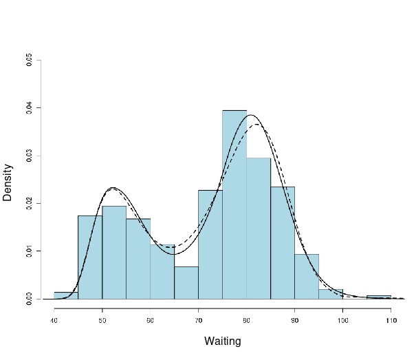
```

]

.pull-right[
```{r, echo=FALSE, out.width = "90%", dpi = 300 , fig.cap="Estimated density with the respective credible interval (dashed line) for waiting times between eruptions for BCTM model", fig.retina = 2,fig.align='center'}
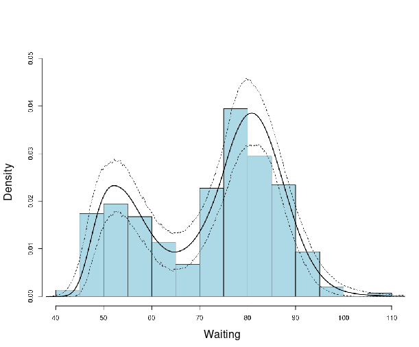
```
]


<style type="text/css">
.tg  {border:none;border-collapse:collapse;border-color:#aaa;border-spacing:0;}
.tg td{background-color:#fff;border-color:#aaa;border-style:solid;border-width:0px;color:#333;
  font-family:Arial, sans-serif;font-size:10px;overflow:hidden;padding:10px 5px;word-break:normal;}
.tg th{background-color:#fff;border-color:#aaa;border-style:solid;border-width:0px;color:#000;
  font-family:Arial, sans-serif;font-size:10px;font-weight:normal;overflow:hidden;padding:10px 5px;word-break:normal;}
.tg .tg-baqh{text-align:center;vertical-align:top}
.tg .tg-ao2g{border-color:#fff;text-align:center;vertical-align:top}
.tg .tg-0pky{border-color:fff;text-align:center;vertical-align:top}
.tg .tg-eqm3{border-color:fff;font-size:10px;text-align:left;vertical-align:top}
</style>
<font size="3">
<table class="tg">
 <caption>Quantiles of estimated distribution.</caption>
<thead>
  <tr>
    <th class="tg-ao2g" rowspan="2"><br>Model<br></th>
    <th class="tg-baqh" colspan="5">Quantile</th>
  </tr>
  <tr>
    <th class = "tg-0pky">0.05</th>
    <th class = "tg-0pky">0.25</th>
    <th class = "tg-0pky">0.5</th>
    <th class = "tg-0pky">0.75</th>
    <th class = "tg-0pky">0.95</th>
  </tr>
</thead>
<tbody>
  <tr>
    <td class = "tg-0pky">BCTM</td>
    <td class = "tg-0pky">49.20</td>
    <td class = "tg-0pky">58.90</td>
    <td class = "tg-0pky">76.20</td>
    <td class = "tg-0pky">83.10</td>
    <td class = "tg-0pky">91.00</td>
  </tr>
  <tr>
    <td class = "tg-0pky">mlt</td>
    <td class = "tg-0pky">49.15</td>
    <td class = "tg-0pky">59.21</td>
    <td class = "tg-0pky">75.81</td>
    <td class = "tg-0pky">83.27</td>
    <td class = "tg-0pky">90.77</td>
  </tr>
</tbody>
</table>

<!---
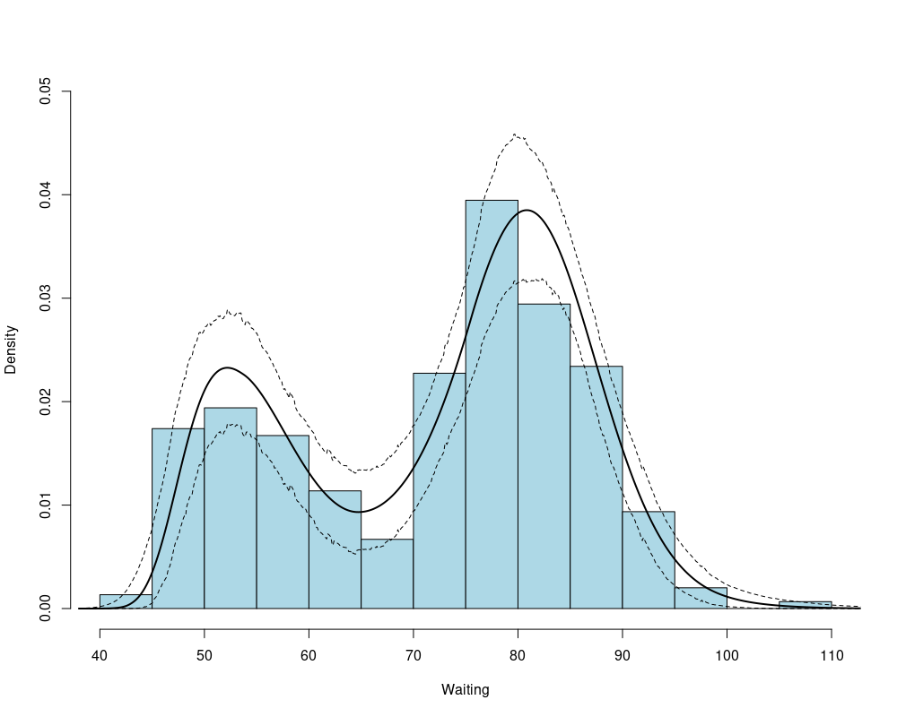

.caption[
Image caption
]

]

.pull-right[


.caption[
Image caption
]
]
--->
---
### Application 2  
___
- We considered a data set which the observations are measures of age ( $x$ ) and head circumference ( $y$ ) of 7040 young Dutch boys.

```{r,  results='asis', echo=FALSE, message=FALSE, warning = FALSE}
library(gamlss)
data("db",package = "gamlss.data")
attach(db)
library(ggplot2)
library(ggExtra)
```

```{r,results='asis', echo=FALSE, message=FALSE, warning = FALSE,  fig.retina=2, fig.align='center',out.width = "40%"}
# Save the scatter plot in a variable
p <- ggplot(db, aes(x = age, y = head)) +
  geom_point(col = "grey", size = 0.51) + theme_classic() +
  xlab("Age") + ylab("Head Circumference")+theme(axis.text=element_text(size=20),
                                   axis.title=element_text(size=14,face="bold"))

# Plot the scatter plot with marginal histograms
ggMarginal(p, type = "histogram",size = 2, fill = "lightblue")

```

---

- `r Citet(myBib,"hothorn2018most")` used the *mlt* package to fit a conditional transformation model for head circumference with explanatory variable $x = age^{1/3}$. 
- We first propose a BCLTM and a linear regression to observe how a restricted model fit this data.

.pull-left[

- BCLTM
$${\small F_Y(y|\boldsymbol{x}) = F_Z(\beta_0 + y\cdot\beta_1 + y\cdot age \cdot \beta_2 + \beta_3 \cdot x)}$$
 
```{r, echo=FALSE,  out.width = "100%", dpi = 300 , fig.retina = 2,fig.align='center'}
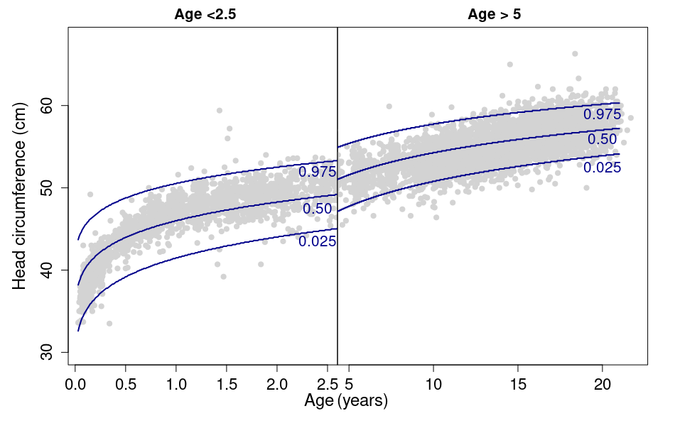
```


]

.pull-right[

- Linear regression
$${\small y_i \sim N(\beta_0 + \beta_1 x_i, \sigma)}$$

```{r, echo=FALSE,  out.width = "100%", dpi = 300 ,  fig.retina = 2,fig.align='center'}
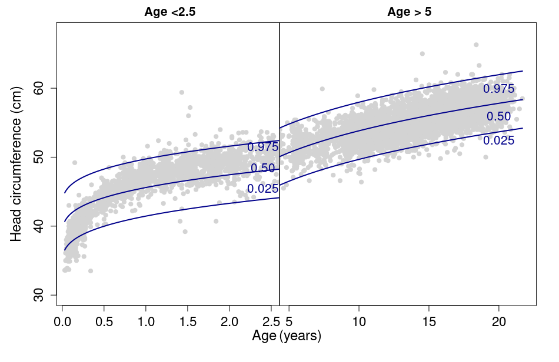
```
] 


---
- We also fitted a BCTM model which considers a non-linear interaction between $y$ and $x$. The model is given by

$$\begin{equation}
    F_Y(y|\boldsymbol{x}) = F_Z(h(y|\boldsymbol{x})) = F_Z(\boldsymbol{a}(y)\otimes \boldsymbol{b}(age) \boldsymbol{\gamma})^T 
\end{equation}$$

where $\boldsymbol{a}$ and $\boldsymbol{b}(age)$ are vectors of evaluated cubic B-spline basis of dimension 7.

.pull-left[
- BCTM

```{r, echo=FALSE,  out.width = "95%",  dpi = 300 , fig.retina = 2,fig.align='center'}
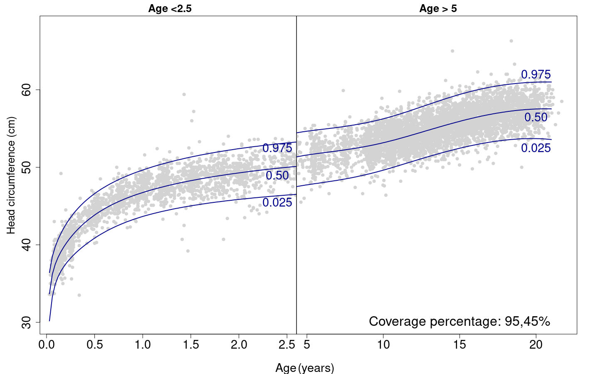
```
 
]
.pull-right[
- CTM

```{r, echo=FALSE,  out.width = "95%",  dpi = 300, fig.retina = 2,fig.align='center'}
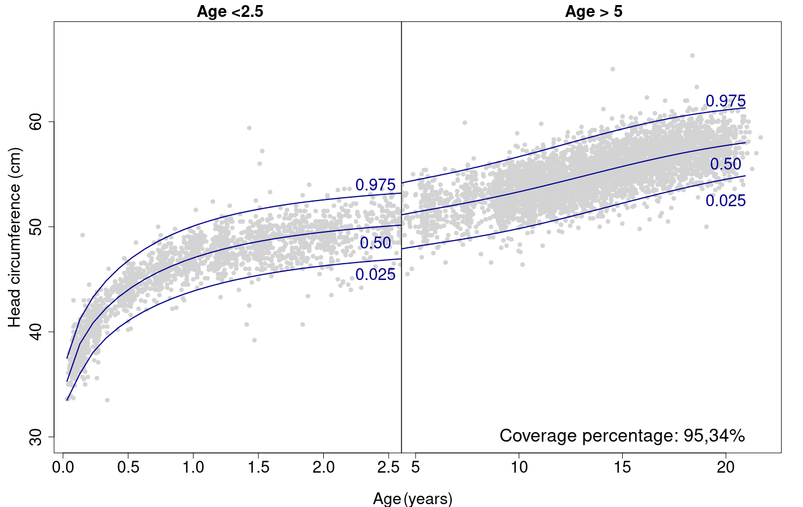
```
] 

---

- In the first model only the expected value and variance are affected by age.

.pull-left[
```{r, echo=FALSE, out.width = "110%", dpi = 300 , fig.cap="Expected value (E(Y)), standard deviation (SD(Y)), Skewness and Kurtosis of BCLTM conditional on Age", fig.retina = 2,fig.align='center'}
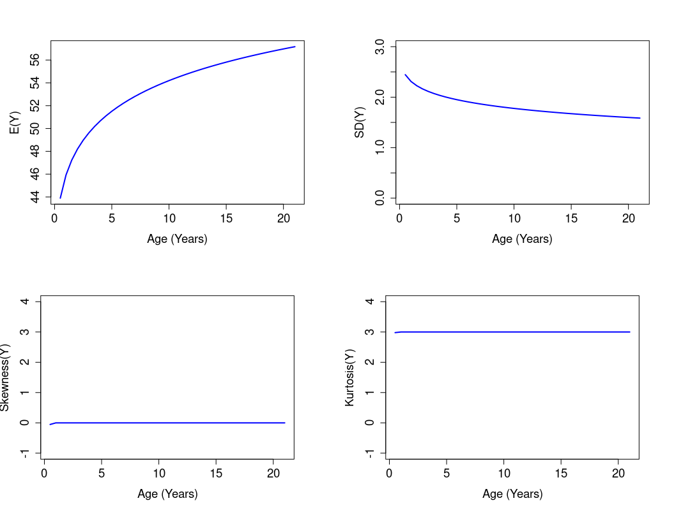
```
 
]
.pull-right[
```{r, echo=FALSE, out.width = "110%", dpi = 300 , fig.cap="Expected value (E(Y)), standard deviation (SD(Y)), Skewness and Kurtosis of BCTM conditional on x", fig.retina = 2,fig.align='center'}
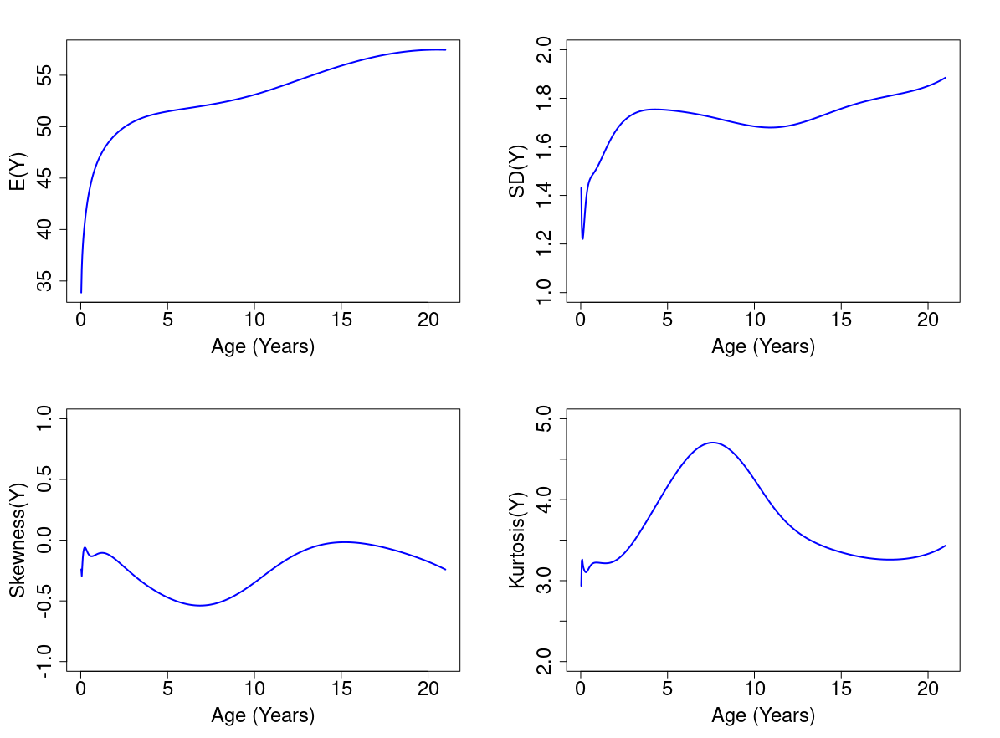
```
] 

---
<!---class: columns-2
--->

### Application 3
___

- The dataset for the third application comes from the Framingham Heart Study. In 1948, the Framingham Heart Study started a project to identify common factors that contribute to cardiovascular disease by following group of participants over a long period.
- `r Citet(myBib,"carlan2023bayesian")` randomly selected 200 participants from the study and their respective cholesterol levels, gender and age measured at the beginning of the study and every two years for ten years.

<style type="text/css">
.tg  {border:none;border-collapse:collapse;border-color:#ccc;border-spacing:0;}
.tg td{background-color:#fff;border-color:#ccc;border-style:solid;border-width:0px;color:#333;
  font-family:Arial, sans-serif;font-size:14px;overflow:hidden;padding:10px 5px;word-break:normal;}
.tg th{background-color:#f0f0f0;border-color:#ccc;border-style:solid;border-width:0px;color:#333;
  font-family:Arial, sans-serif;font-size:14px;font-weight:normal;overflow:hidden;padding:10px 5px;word-break:normal;}
.tg .tg-0lax{text-align:left;vertical-align:top}
</style>
<font size="3">
<table class="tg">
 <caption>First six observations from the Framingham dataset</caption>
    <tr>
        <th>Id</th>
        <th>Cholesterol level</th>
        <th>Sex</th>
        <th>Age</th>
        <th>Year</th>
    </tr>
    <tr>
        <td>1</td>
        <td>175</td>
        <td>1</td>
        <td>32</td>
        <td>0</td>
    </tr>
    <tr>
        <td>1</td>
        <td>198</td>
        <td>1</td>
        <td>32</td>
        <td>2</td>
    </tr>
    <tr>
        <td>1</td>
        <td>205</td>
        <td>1</td>
        <td>32</td>
        <td>4</td>
    </tr>
    <tr>
        <td>1</td>
        <td>228</td>
        <td>1</td>
        <td>32</td>
        <td>6</td>
    </tr>
    <tr>
        <td>1</td>
        <td>214</td>
        <td>1</td>
        <td>32</td>
        <td>8</td>
    </tr>
    <tr>
        <td>1</td>
        <td>214</td>
        <td>1</td>
        <td>32</td>
        <td>10</td>
    </tr>
</table>

---
- Carlan proposed two different models to predict and make inferences about cholesterol individuals based on their sex and age.
- The models proposed estimated a different probability distribution for the individual's cholesterol for each age and sex.
- The first one is given by 

$$\begin{align}
P(cholst \leq y | \boldsymbol{x}) & = \Phi(h1(y) + h_2(y|age) + h_3(y|year) + h_4(y|sex))  \nonumber \\
& =  \Phi(\gamma_0 + \boldsymbol{a}(y)^{T}\boldsymbol{\gamma_1} + \textrm{age} \cdot \boldsymbol{a}(y)^{T}\boldsymbol{\gamma_2}  + \textrm{year} \cdot \gamma_3 + \textrm{sex} \cdot \gamma_4) \end{align}$$
- The B-spline employed in $\boldsymbol{a}$ is bases of dimension $D_1 = 20$, and it implies that the vector $\boldsymbol{\gamma} = (\gamma_0, \boldsymbol{\gamma}_1, \boldsymbol{\gamma}_2, \boldsymbol{\gamma}_3, \boldsymbol{\gamma}_4)$ has 42 parameters.
- The prior precision matrix for the splines parameters $\boldsymbol{\gamma}_1$ and $\boldsymbol{\gamma}_2$ considers one hyper-parameter

$$\begin{equation}\label{vcm_matrix}
\boldsymbol{K} = \frac{1}{\tau}\begin{pmatrix}
 \boldsymbol{K_1} & 0\\
 0 & \boldsymbol{K_2}
\end{pmatrix}.
\end{equation}$$
- The $\boldsymbol{K}_1$ and $\boldsymbol{K}_1$ are the first-order penalization matrices.
---

- In the second model we assume a non-linear interaction between cholesterol level and age

$$\begin{align}
P(cholst \leq y | \boldsymbol{x}) &  = \Phi(h1(y|age) + h_2(y|year) + h_3(y|sex)) \nonumber \\
& = \Phi((\boldsymbol{a}(y)^{T} \otimes \boldsymbol{b}_1(\textrm{age})^T)^T \boldsymbol{\gamma_1} + \textrm{year} \cdot \gamma_2 + \textrm{sex} \cdot \gamma_3)
\end{align}$$
which both $\boldsymbol{a}(y)$ and $\boldsymbol{b}(x)$ consist of 10-dimensional B-splines basis.
- The vector of parameters $\boldsymbol{\gamma} = (\gamma_0,\boldsymbol{\gamma}_1, \gamma_2, \gamma_3)$ has 102 parameters.
- We considered the following precision matrix

$$\begin{equation}\label{tensor_matrix}
    K(\tau) = \frac{1}{\tau}[(\boldsymbol{K}_1 \otimes \boldsymbol{I}_{10}) + (\boldsymbol{I}_{10} \otimes \boldsymbol{K}_2 )],
\end{equation}$$
- Additionally, both models augmented with individual-specific i.i.d random effects were considered.
- The precision matrix for normal multivariate with random effects is constructed as

$$\boldsymbol{K}_{re} = \begin{pmatrix}
 \boldsymbol{K}(\tau) & 0\\
 0 &  \tau_{re} \boldsymbol{I}
\end{pmatrix}.$$

---
- We benchmark our implemented algorithm against the NUTS algorithm. 
- The size chain for the NUTS algorithm was 4000 with 2000 as burn-in.


<style type="text/css">
.tg  {border-collapse:collapse;border-color:#ccc;border-spacing:0;}
.tg td{background-color:#fff;border-bottom-width:1px;border-color:#ccc;border-style:solid;border-top-width:1px;
  border-width:0px;color:#333;font-family:Arial, sans-serif;font-size:16px;overflow:hidden;padding:10px 5px;
  word-break:normal;}
.tg th{background-color:#f0f0f0;border-bottom-width:1px;border-color:#ccc;border-style:solid;border-top-width:1px;
  border-width:0px;color:#333;font-family:Arial, sans-serif;font-size:16px;font-weight:normal;overflow:hidden;
  padding:10px 5px;word-break:normal;}
.tg .tg-xvg5{background-color:#f9f9f9;border-color:#aaaaaa;text-align:left;vertical-align:top}
.tg .tg-buh4{background-color:#f9f9f9;text-align:left;vertical-align:top}
.tg .tg-0lax{text-align:left;vertical-align:top}
.tg .tg-dzk6{background-color:#f9f9f9;text-align:center;vertical-align:top}
.tg .tg-73oq{border-color:#000000;text-align:left;vertical-align:top}
</style>
<font size="4">
<table class="tg">
 <caption>DIC and elapsed time second from the two models fitted by different algorithms.</caption>
<thead>
  <tr>
    <th class="tg-0lax">Model</th>
    <th class="tg-0lax">Method</th>
    <th class="tg-0lax">DIC</th>
    <th class="tg-0lax">Time</th>
  </tr>
</thead>
<tbody>
  <tr>
    <td class="tg-dzk6" rowspan="2"><br>Model 1</td>
    <td class="tg-buh4">INLA based</td>
    <td class="tg-buh4">2769.26</td>
    <td class="tg-buh4">21.98</td>
  </tr>
  <tr>
    <td class="tg-73oq">NUTS</td>
    <td class="tg-73oq">2787.02</td>
    <td class="tg-73oq">1027.12</td>
  </tr>
  <tr>
    <td class="tg-dzk6" rowspan="2">Model 1<br><br>random effects</td>
    <td class="tg-xvg5">INLA based</td>
    <td class="tg-xvg5">1604.01</td>
    <td class="tg-xvg5">619.05</td>
  </tr>
  <tr>
    <td class="tg-0lax">NUTS</td>
    <td class="tg-0lax">1567.38</td>
    <td class="tg-0lax">10716.02</td>
  </tr>
  <tr>
    <td class="tg-dzk6" rowspan="2"><br>Model 2</td>
    <td class="tg-buh4">INLA based</td>
    <td class="tg-buh4">2721.04</td>
    <td class="tg-buh4">38.88</td>
  </tr>
  <tr>
    <td class="tg-0lax">NUTS</td>
    <td class="tg-0lax">2716.30</td>
    <td class="tg-0lax">2761.90</td>
  </tr>
  <tr>
    <td class="tg-dzk6" rowspan="2">Model 2<br>random effects</td>
    <td class="tg-buh4">INLA based</td>
    <td class="tg-buh4">1562.99</td>
    <td class="tg-buh4">1551.29</td>
  </tr>
  <tr>
    <td class="tg-0lax">NUTS</td>
    <td class="tg-0lax">1568.88</td>
    <td class="tg-0lax">22735.07</td>
  </tr>
</tbody>
</table>

---


.pull-left[
```{r, echo=FALSE, out.width = "60%", dpi = 300 , fig.cap="Coefficients from the VCM model.", fig.retina = 2,fig.align='center'}
knitr::include_graphics("figuras/coefs_vcm2.png")
```

```{r, echo=FALSE, out.width = "55%", dpi = 300 , fig.cap="Coefficients from the VCM random effects model.", fig.retina = 2,fig.align='center'}
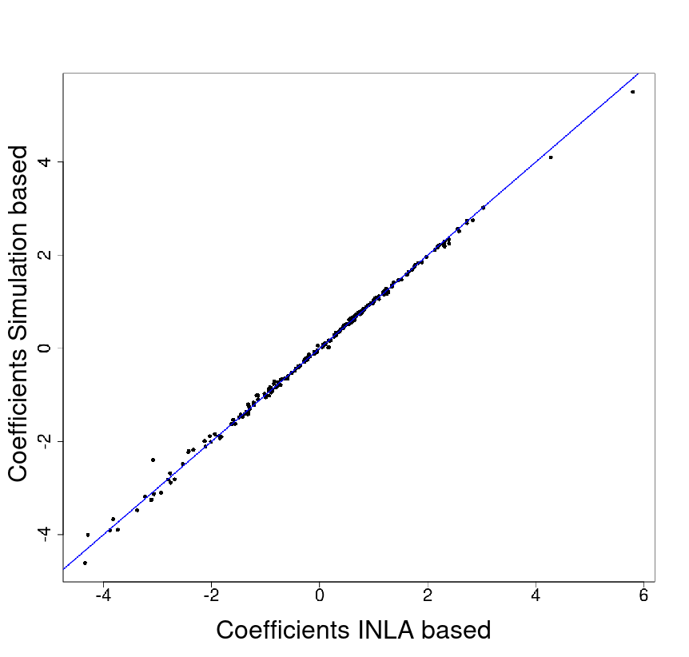
```
 
]
.pull-right[
```{r, echo=FALSE, out.width = "55%", dpi = 300 , fig.cap="Coefficients from the Tensor model.", fig.retina = 2,fig.align='center'}
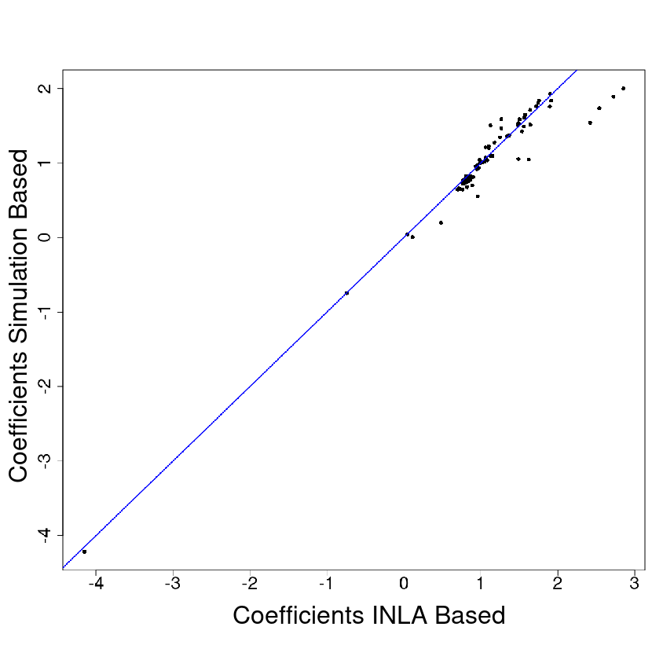
```

```{r, echo=FALSE, out.width = "55%", dpi = 300 , fig.cap="Coefficients from the Tensor random effects model.", fig.retina = 2,fig.align='center'}
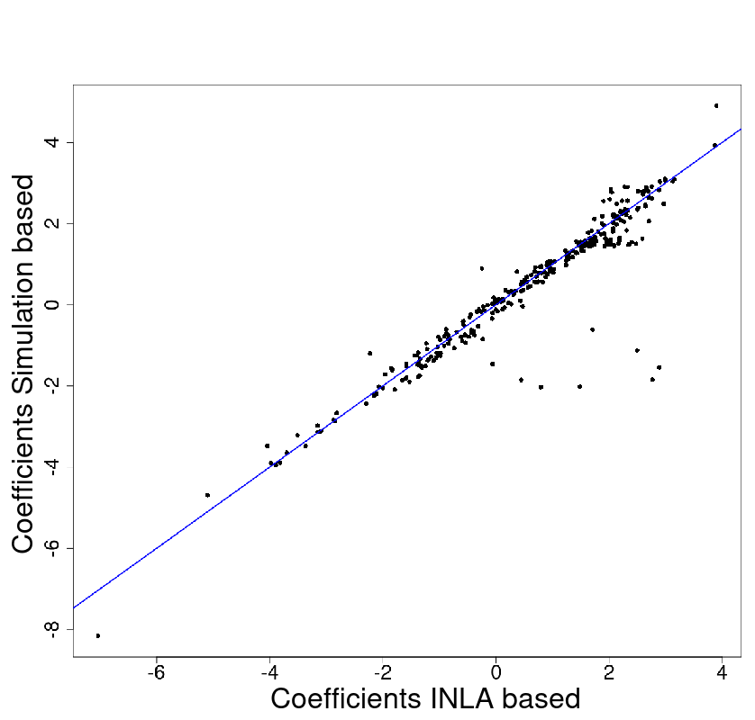
```
] 


---

.pull-left[
```{r, echo=FALSE, out.width = "110%", dpi = 300 , fig.cap="95% quantile interval and the median for every individual posterior cumulative distribution estimated by INLA based algorithm for the VCM random effects model.", fig.retina = 2,fig.align='center'}
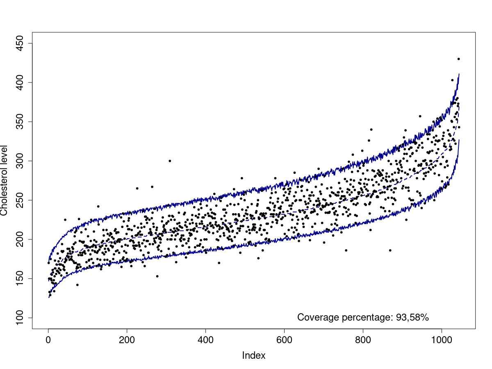
```

]

.pull-right[
```{r, echo=FALSE, out.width = "110%", dpi = 300 , fig.cap="95% quantile interval and the median for every individual posterior cumulative distribution estimated by stochastic simulation for the VCM random effects model.", fig.retina = 2,fig.align='center'}
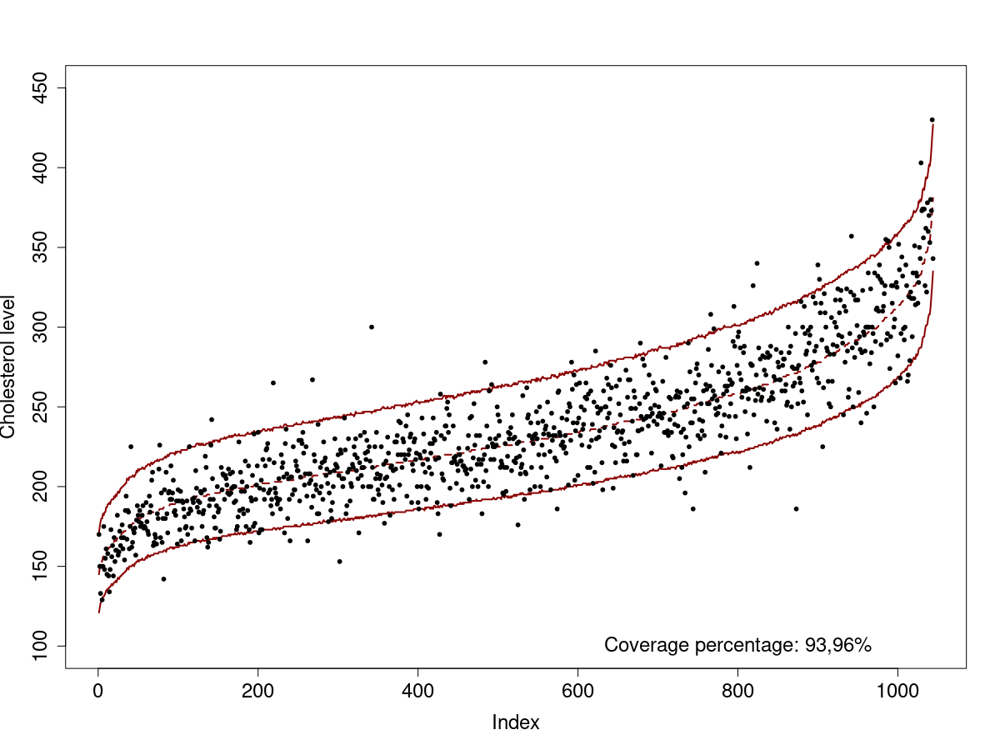
```
]
---
 

.pull-left[
```{r, echo=FALSE, out.width = "110%", dpi = 400 , fig.cap="95% quantile interval and the median for every individual posterior cumulative distribution estimated by INLA based algorithm for the tensor random effects model.", fig.retina = 2,fig.align='center'}
knitr::include_graphics("figuras/Tensor_re_IC.png")
```
]

.pull-right[
```{r, echo=FALSE, out.width = "110%", dpi = 400 , fig.cap="95% quantile interval and the median for every individual posterior cumulative distribution estimated by stochastic simulation for the tensor random effects model.", fig.retina = 2,fig.align='center'}
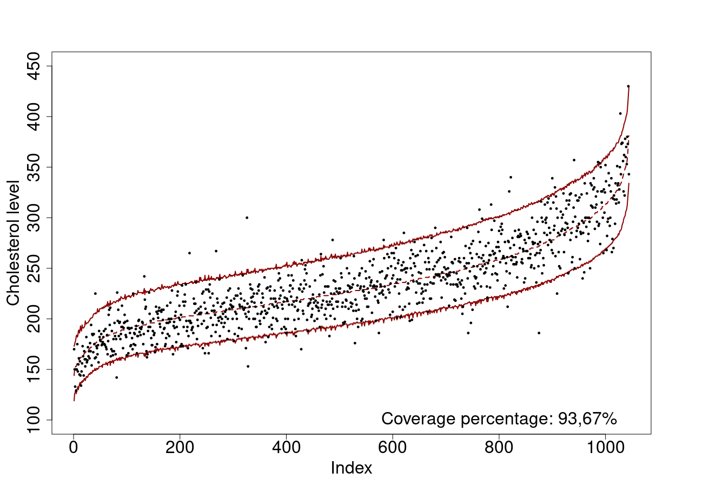
```
] 

---

- Let us consider the Tensor model again. We can see the impact of age on the cholesterol level of male individuals in the middle of study.


.pull-left[
```{r, echo=FALSE, out.width = "90%", dpi = 300 , fig.cap="Posterior estimated densities of the Tensor model for different male individual ages in the middle of the study. Shown are the estimated.", fig.retina = 2,fig.align='center'}
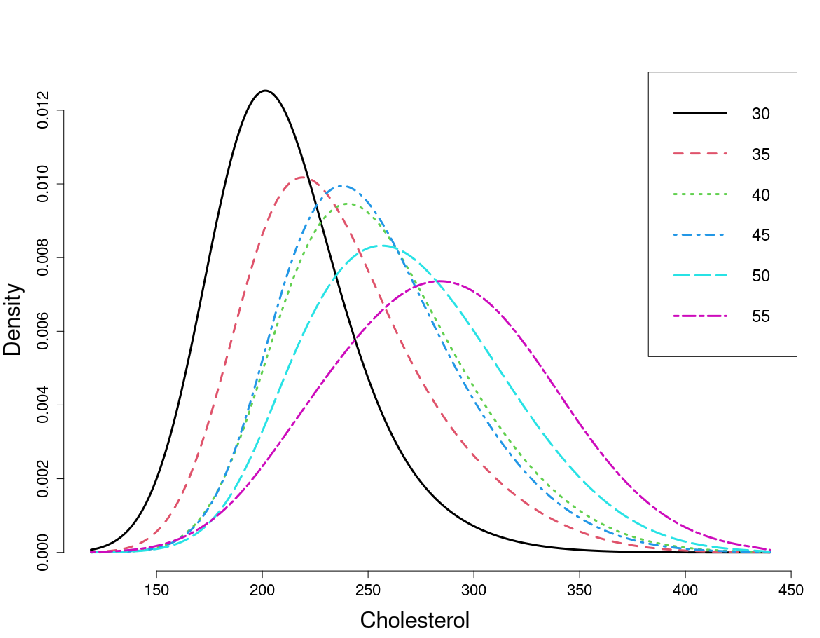
```
]

.pull-right[
```{r, echo=FALSE, out.width = "90%", dpi = 300 , fig.cap="Expected value (E(Y)), standard deviation (SD(Y)), Skewness and Kurtosis of Tensor model conditional on Age.", fig.retina = 2,fig.align='center'}
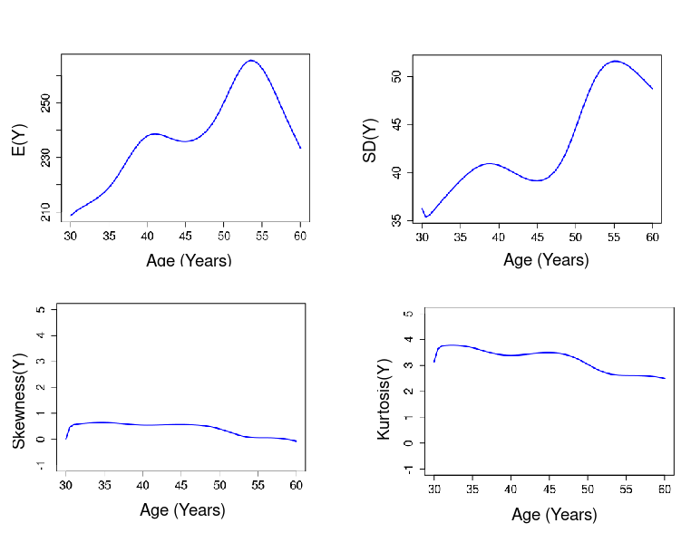
```
]
---
### Final remarks
___
- The BCTM targets a flexible estimation leaving aside any parametric and linear restriction on conditional transformation function. However, flexibility comes with a price, and the interpretability of the model is restrictive. 
- Taking apart some discrepancies between the fitted models, our alternative estimation process obtained similar DIC and estimated quantile posterior intervals for the observations. 
- The main result of this application is the gap between the elapsed time provided by the two Bayesian estimation procedures.
- A simulation study for the recovery of parameters model and transformation function will guide us to detect any algorithm problem. 
- Some alterations in the BCTM models presented here are available for discussion.
  - A multivariate CTM, where $F_Z$ is a multivariate Gaussian distribution.
  - Bernstein polynomial could be a alternative for the B-spline.
  - A Deep CTM using neural network predictors.
---
- Some aspects should be improved in the algorithm.
  - Can we reduce the points of exploration from hyperparameter distribution?
  - A faster algorithm to find the mode of distribution of the hyperparameters.
  - Extend the algorithm for more than two hyperparameters.
- Residual analysis.

---

class: center, middle

Obrigado!


